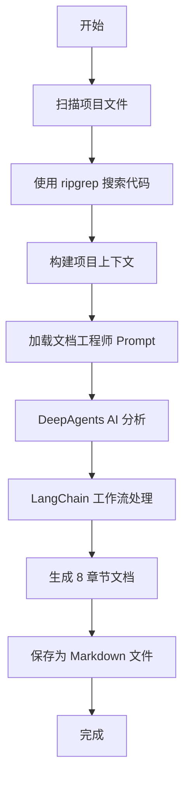

# CodeViewX

> 🚀 AI 驱动的智能代码文档生成器 | 基于 DeepAgents 和 LangChain

[](https://www.gnu.org/licenses/gpl-3.0)
[](https://www.python.org/downloads/)
[](https://github.com/dean2021/codeviewx/releases)

CodeViewX 是一个革命性的智能代码文档生成工具，它利用先进的 AI 技术（基于 Anthropic Claude 和 DeepAgents 框架）深入分析您的代码库，自动生成全面、专业、高质量的技术文档。

**为什么选择 CodeViewX？**
- ✅ 自动化生成完整的技术文档，节省大量手动编写时间
- ✅ AI 深度理解代码逻辑和架构，生成准确、深入的分析
- ✅ 支持多语言文档输出，适应全球化团队需求
- ✅ 内置美观的 Web 界面，便于团队协作和知识分享
- ✅ 可集成到 CI/CD 流程，实现文档自动化更新

**📚 完整文档：** [中文](docs/zh/README.md) | [English](docs/en/README.md)

## ✨ 核心特性

### 🤖 AI 智能分析
- 基于 **Anthropic Claude** 大语言模型，具备强大的代码理解能力
- 集成 **DeepAgents** 框架，实现多步骤自主代码分析
- 使用 **LangChain** 和 **LangGraph** 构建复杂的文档生成工作流

### 📝 完整文档体系
自动生成 8 个核心章节的技术文档：
- 📋 项目概览（项目简介、核心特性、技术栈）
- 🚀 快速开始（安装指南、基本用法、配置说明）
- 🏗️ 系统架构（架构图、模块设计、依赖关系）
- ⚙️ 核心机制（关键算法、工作流程、设计模式）
- 📊 数据模型（数据结构、实体关系、存储方案）
- 🔌 API 参考（接口文档、参数说明、示例代码）
- 💻 开发指南（开发环境、代码规范、最佳实践）
- 🧪 测试文档（测试策略、测试用例、质量保证）

### 🌐 内置 Web 服务器
- 美观的文档浏览界面，支持响应式设计
- 完整的 Markdown 渲染（支持 GFM、表格、代码高亮）
- **Mermaid 图表**支持（流程图、时序图、类图等）
- 实时搜索和导航功能
- 支持多文档项目切换

### 🌍 多语言国际化
支持 **8 种语言**的文档生成：
- 🇨🇳 简体中文 (Chinese)
- 🇺🇸 英文 (English)
- 🇯🇵 日文 (Japanese)
- 🇰🇷 韩文 (Korean)
- 🇫🇷 法文 (French)
- 🇩🇪 德文 (German)
- 🇪🇸 西班牙文 (Spanish)
- 🇷🇺 俄文 (Russian)

### 📊 智能进度显示
- 实时显示文档生成进度和当前步骤
- 分析状态可视化（文件扫描、AI 处理、文档生成）
- 详细的日志输出（支持 verbose 模式）

### 🔧 灵活的使用方式
- **命令行工具**：简单易用的 CLI 接口，支持丰富的参数配置
- **Python API**：可作为库集成到您的项目或工具链中
- **可配置**：支持自定义工作目录、输出路径、递归限制等

### 🚀 高性能代码搜索
- 集成 **ripgrep**（rg），提供超快的代码搜索能力
- 智能的文件过滤和模式匹配
- 支持正则表达式和多种搜索选项

## 📦 安装

### 系统要求
- Python 3.8 或更高版本
- pip 包管理器
- ripgrep (rg) 代码搜索工具
- Anthropic API Key（用于 Claude AI 服务）

### 安装步骤

#### 1. 克隆项目
```bash
git clone https://github.com/dean2021/codeviewx.git
cd codeviewx
```

#### 2. 安装 Python 依赖
```bash
# 方式 1: 开发模式安装（推荐用于开发）
pip install -e .

# 方式 2: 标准安装
pip install .

# 方式 3: 安装开发依赖（用于开发和测试）
pip install -e ".[dev]"
```

#### 3. 安装 ripgrep
```bash
# macOS (使用 Homebrew)
brew install ripgrep

# Ubuntu/Debian
sudo apt install ripgrep

# Windows (使用 Chocolatey)
choco install ripgrep

# 或下载二进制文件: https://github.com/BurntSushi/ripgrep/releases
```

#### 4. 配置 API 密钥
```bash
# 临时设置（当前终端会话有效）
export ANTHROPIC_API_KEY='your-api-key-here'

# 永久设置（添加到 ~/.bashrc 或 ~/.zshrc）
echo 'export ANTHROPIC_API_KEY="your-api-key-here"' >> ~/.bashrc
source ~/.bashrc

# 或添加到 ~/.zshrc（macOS 默认）
echo 'export ANTHROPIC_API_KEY="your-api-key-here"' >> ~/.zshrc
source ~/.zshrc
```

**获取 API Key：** 访问 [Anthropic Console](https://console.anthropic.com/) 注册并获取 API 密钥。

## 🚀 快速开始

### 命令行使用

#### 基础用法
```bash
# 1. 分析当前目录并生成文档（默认输出到 docs 目录）
codeviewx

# 2. 指定项目路径和输出目录
codeviewx -w /path/to/project -o documentation

# 3. 生成英文文档
codeviewx -w /path/to/project -l English

# 4. 生成日文文档
codeviewx -w /path/to/project -l Japanese -o docs/ja
```

#### 多语言支持
```bash
# 支持的语言选项：
codeviewx -w . -l Chinese    # 中文
codeviewx -w . -l English    # 英文
codeviewx -w . -l Japanese   # 日文
codeviewx -w . -l Korean     # 韩文
codeviewx -w . -l French     # 法文
codeviewx -w . -l German     # 德文
codeviewx -w . -l Spanish    # 西班牙文
codeviewx -w . -l Russian    # 俄文
```

#### 启动 Web 服务器
```bash
# 启动文档浏览服务器
codeviewx --serve -o docs
# 在浏览器中访问: http://127.0.0.1:5000

# 指定其他输出目录
codeviewx --serve -o documentation

# 查看多语言文档示例
codeviewx --serve -o docs/zh  # 中文文档
codeviewx --serve -o docs/en  # 英文文档
```

#### 高级选项
```bash
# 启用详细日志输出
codeviewx -w /path/to/project --verbose

# 自定义递归限制（用于大型项目）
codeviewx -w /path/to/project --recursion-limit 2000

# 查看版本信息
codeviewx --version

# 查看帮助信息
codeviewx --help
```

### Python API

#### 基础使用
```python
from codeviewx import generate_docs

# 最简单的用法：分析当前目录
generate_docs()

# 指定项目路径和输出目录
generate_docs(
    working_directory="/path/to/project",
    output_directory="docs"
)

# 生成指定语言的文档
generate_docs(
    working_directory="/path/to/project",
    output_directory="docs",
    doc_language="English"
)
```

#### 完整配置示例
```python
from codeviewx import generate_docs

# 完整参数配置
generate_docs(
    working_directory="/path/to/your/project",  # 项目路径
    output_directory="documentation",           # 输出目录
    doc_language="Chinese",                     # 文档语言
    ui_language="zh",                          # UI 语言（zh 或 en）
    recursion_limit=1500,                      # 递归限制
    verbose=True                               # 详细日志
)
```

#### 启动 Web 服务器
```python
from codeviewx import start_document_web_server

# 启动文档浏览服务器
start_document_web_server("docs")
# 服务器将在 http://127.0.0.1:5000 启动
```

#### 加载提示词模板
```python
from codeviewx import load_prompt

# 加载文档工程师提示词
prompt = load_prompt(
    "DocumentEngineer",
    working_directory="/path/to/project",
    output_directory="docs"
)

print(f"Prompt length: {len(prompt)} characters")
```

#### 集成到 CI/CD
```python
#!/usr/bin/env python3
"""
在 CI/CD 流程中自动生成文档
"""
import os
import sys
from codeviewx import generate_docs

try:
    # 生成项目文档
    generate_docs(
        working_directory=os.getcwd(),
        output_directory="docs",
        doc_language="English",
        verbose=True
    )
    print("✅ 文档生成成功！")
    sys.exit(0)
except Exception as e:
    print(f"❌ 文档生成失败: {e}")
    sys.exit(1)
```

## 📖 生成的文档

CodeViewX 自动生成完整的 8 章节技术文档，每个章节都经过 AI 深度分析和精心撰写：

### 文档结构

| 章节 | 内容 | 说明 |
|-----|------|------|
| 📋 **01-项目概览** | 项目简介、核心特性、技术栈、团队信息 | 让读者快速了解项目全貌 |
| 🚀 **02-快速开始** | 环境要求、安装步骤、基本用法、配置指南 | 帮助新用户快速上手 |
| 🏗️ **03-系统架构** | 架构设计、模块划分、依赖关系、Mermaid 图表 | 理解系统整体设计 |
| ⚙️ **04-核心机制** | 关键算法、工作流程、设计模式、实现细节 | 深入了解核心功能 |
| 📊 **05-数据模型** | 数据结构、实体关系、存储方案、ER 图 | 掌握数据设计 |
| 🔌 **06-API 参考** | 接口文档、参数说明、返回值、代码示例 | 方便 API 集成 |
| 💻 **07-开发指南** | 开发环境、代码规范、最佳实践、贡献指南 | 规范开发流程 |
| 🧪 **08-测试文档** | 测试策略、测试用例、覆盖率、质量保证 | 确保代码质量 |

### 文档特点

- ✅ **自动生成**：无需手动编写，AI 自动分析代码生成
- ✅ **内容完整**：涵盖技术文档的各个方面
- ✅ **格式规范**：使用标准 Markdown 格式，支持 Mermaid 图表
- ✅ **深度分析**：AI 深入理解代码逻辑，而非简单的代码注释提取
- ✅ **持续更新**：代码更新后可重新生成，保持文档同步

### 示例文档

**查看完整文档示例：** [中文文档](docs/zh/) | [English Documentation](docs/en/)

### 输出格式

```
docs/
├── 01-项目概览.md
├── 02-快速开始.md
├── 03-系统架构.md
├── 04-核心机制.md
├── 05-数据模型.md
├── 06-API参考.md
├── 07-开发指南.md
├── 08-测试文档.md
└── README.md          # 文档索引
```

## 🏗️ 工作原理

CodeViewX 的工作流程如下：



### 技术架构

- **代码分析层**：使用 ripgrep 快速扫描和搜索代码文件
- **AI 处理层**：基于 Anthropic Claude 3.5 Sonnet 进行智能分析
- **工作流层**：使用 LangChain 和 LangGraph 构建复杂的文档生成流程
- **Agent 层**：DeepAgents 提供自主代码分析能力
- **输出层**：生成标准 Markdown 文档，支持 Mermaid 图表

## 🔧 开发指南

### 开发环境设置

```bash
# 1. 克隆项目
git clone https://github.com/dean2021/codeviewx.git
cd codeviewx

# 2. 创建虚拟环境（推荐）
python -m venv venv
source venv/bin/activate  # Linux/macOS
# 或
.\venv\Scripts\activate  # Windows

# 3. 安装开发依赖
pip install -e ".[dev]"

# 4. 安装 ripgrep
brew install ripgrep  # macOS
```

### 运行测试

```bash
# 运行所有测试
pytest

# 运行特定测试文件
pytest tests/test_core.py

# 运行测试并显示覆盖率
pytest --cov=codeviewx --cov-report=html

# 运行测试（详细输出）
pytest -v

# 运行测试（显示打印输出）
pytest -s
```

### 代码质量检查

```bash
# 代码格式化（使用 Black）
black codeviewx/

# 代码风格检查（使用 flake8）
flake8 codeviewx/

# 类型检查（使用 mypy）
mypy codeviewx/

# 导入排序（使用 isort）
isort codeviewx/
```

### 项目结构

```
codeviewx/
├── codeviewx/              # 主包
│   ├── __init__.py        # 包初始化
│   ├── __version__.py     # 版本信息
│   ├── cli.py             # 命令行接口
│   ├── core.py            # 核心 API
│   ├── generator.py       # 文档生成器
│   ├── i18n.py            # 国际化支持
│   ├── language.py        # 语言检测
│   ├── prompt.py          # 提示词管理
│   ├── server.py          # Web 服务器
│   ├── prompts/           # 提示词模板
│   │   ├── document_engineer.md     # 英文提示词
│   │   └── document_engineer_zh.md  # 中文提示词
│   ├── tools/             # 工具模块
│   │   ├── command.py     # 命令执行
│   │   ├── filesystem.py  # 文件系统操作
│   │   └── search.py      # 代码搜索
│   ├── tpl/               # 模板文件
│   │   └── doc_detail.html  # 文档浏览模板
│   └── static/            # 静态资源
│       └── css/           # 样式文件
├── tests/                 # 测试文件
├── examples/              # 示例代码
├── docs/                  # 文档目录
├── pyproject.toml         # 项目配置
├── requirements.txt       # 依赖列表
└── README.md              # 项目说明
```

### 添加新功能

1. 在相应的模块中编写代码
2. 添加单元测试到 `tests/` 目录
3. 更新文档（如果需要）
4. 运行测试确保通过
5. 提交 Pull Request

## 🤝 贡献指南

我们欢迎并感谢所有形式的贡献！无论是报告 Bug、提出新功能建议，还是提交代码改进，都能帮助 CodeViewX 变得更好。

### 如何贡献

#### 1. 报告问题
如果您发现 Bug 或有功能建议：
- 在 [GitHub Issues](https://github.com/dean2021/codeviewx/issues) 创建新 Issue
- 详细描述问题或建议
- 如果是 Bug，请提供复现步骤和环境信息

#### 2. 提交代码
```bash
# 1. Fork 项目到您的 GitHub 账号

# 2. 克隆您的 Fork
git clone https://github.com/your-username/codeviewx.git
cd codeviewx

# 3. 创建新分支
git checkout -b feature/your-feature-name

# 4. 进行修改并提交
git add .
git commit -m "Add: your feature description"

# 5. 推送到您的 Fork
git push origin feature/your-feature-name

# 6. 在 GitHub 上创建 Pull Request
```

#### 3. 代码规范
- 遵循 PEP 8 Python 代码规范
- 使用 Black 进行代码格式化
- 添加适当的注释和文档字符串
- 为新功能编写单元测试
- 确保所有测试通过

#### 4. 提交信息规范
```
Add: 新增功能
Fix: 修复 Bug
Update: 更新功能
Refactor: 重构代码
Docs: 文档更新
Test: 测试相关
Style: 代码格式调整
```

### 贡献者
感谢所有为 CodeViewX 做出贡献的开发者！

## ❓ 常见问题

### Q1: 生成文档需要多长时间？
**A:** 取决于项目大小和复杂度，一般中小型项目需要 2-5 分钟。大型项目可能需要 10-15 分钟。

### Q2: 支持哪些编程语言？
**A:** CodeViewX 可以分析任何编程语言的项目。AI 会根据代码内容自动理解项目结构和逻辑。

### Q3: API 调用会产生多少费用？
**A:** 使用 Anthropic Claude API，中小型项目通常花费 $0.1-0.5，大型项目可能需要 $1-3。具体取决于项目规模。

### Q4: 可以自定义文档模板吗？
**A:** 可以！您可以修改 `codeviewx/prompts/` 目录下的提示词模板来自定义生成的文档风格和内容。

### Q5: 生成的文档可以编辑吗？
**A:** 完全可以！生成的文档是标准 Markdown 格式，您可以自由编辑和调整。

### Q6: 如何处理大型项目？
**A:** 对于大型项目，可以：
- 增加 `--recursion-limit` 参数
- 使用 `--verbose` 查看详细进度
- 考虑分模块生成文档

### Q7: 是否支持私有项目？
**A:** 是的，CodeViewX 在本地运行，只有生成文档时会调用 Anthropic API。确保遵守您的代码保密协议。

### Q8: 可以离线使用吗？
**A:** 不能完全离线，因为需要调用 Anthropic Claude API 进行 AI 分析。但文档浏览器可以离线使用。

## 🚀 路线图

### v0.2.0（计划中）
- [ ] 支持更多 AI 模型（OpenAI GPT-4、本地 LLM）
- [ ] 增量文档更新（只更新修改的部分）
- [ ] 自定义文档模板编辑器
- [ ] PDF 导出功能

### v0.3.0（计划中）
- [ ] 交互式架构图生成
- [ ] 代码审查和建议功能
- [ ] 团队协作功能
- [ ] 文档版本控制

### 未来计划
- 支持多项目文档聚合
- AI 驱动的代码质量分析
- 集成主流文档平台（Confluence、Notion 等）
- VS Code / JetBrains IDE 插件

## 📊 项目统计

- **⭐ Stars**: 给项目点个星，让更多人发现它！
- **🐛 Issues**: [查看开放的问题](https://github.com/dean2021/codeviewx/issues)
- **🔀 Pull Requests**: [查看贡献](https://github.com/dean2021/codeviewx/pulls)
- **📝 License**: GPL-3.0

## 📄 许可证

本项目采用 **GNU General Public License v3.0** 许可证。

这意味着：
- ✅ 可以自由使用、修改和分发
- ✅ 可以用于商业用途
- ⚠️ 修改后的代码必须开源
- ⚠️ 必须保留原作者版权信息

详见 [LICENSE](LICENSE) 文件。

## 📮 联系与支持

### 获取帮助
- 📖 **文档**: [完整文档](docs/)
- 💬 **GitHub Issues**: [提问和反馈](https://github.com/dean2021/codeviewx/issues)
- 📧 **Email**: dean@csoio.com

### 社区
- **GitHub**: [@dean2021](https://github.com/dean2021)
- **项目主页**: [CodeViewX](https://github.com/dean2021/codeviewx)

### 反馈建议
如果您有任何建议或想法，欢迎：
1. 创建 GitHub Issue
2. 发送邮件至 dean@csoio.com
3. 提交 Pull Request

## 🌟 致谢

CodeViewX 的开发得益于以下优秀的开源项目：

- [Anthropic Claude](https://www.anthropic.com/) - 强大的 AI 模型
- [DeepAgents](https://github.com/whoami1234321/deepagents) - AI Agent 框架
- [LangChain](https://www.langchain.com/) - LLM 应用框架
- [LangGraph](https://langchain-ai.github.io/langgraph/) - 工作流编排
- [ripgrep](https://github.com/BurntSushi/ripgrep) - 快速代码搜索
- [Flask](https://flask.palletsprojects.com/) - Web 框架
- [Markdown](https://python-markdown.github.io/) - Markdown 渲染

感谢所有开源贡献者！

---

<div align="center">

### ⭐ 如果这个项目对您有帮助，请给个星标！⭐

**让 AI 帮您写文档，把时间留给更重要的事情！**

[GitHub](https://github.com/dean2021/codeviewx) • [文档](docs/) • [报告问题](https://github.com/dean2021/codeviewx/issues)

</div>
