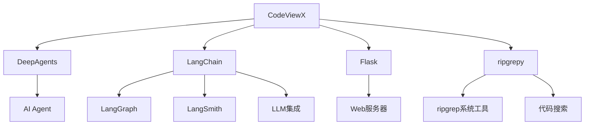

# 项目概览

## 项目简介

CodeViewX 是一个创新的 AI 驱动代码文档生成工具，旨在通过人工智能技术自动分析代码库并生成高质量的技术文档。该项目基于 DeepAgents 和 LangChain 框架构建，为开发者提供了一种全新的文档生成解决方案。

## 技术栈

### 核心框架

| 技术组件 | 版本 | 用途 |
|---------|------|------|
| **Python** | 3.8+ | 主要编程语言 |
| **DeepAgents** | 0.0.5+ | AI Agent 框架，提供智能分析能力 |
| **LangChain** | 0.3.27+ | AI 应用开发框架，支持 LLM 集成 |
| **LangGraph** | 0.6.10+ | 图形化 AI 工作流框架 |
| **LangSmith** | 0.4.34+ | AI 应用监控和调试工具 |

### Web 服务框架

| 技术组件 | 版本 | 用途 |
|---------|------|------|
| **Flask** | 3.0.0+ | Web 服务器框架，用于文档浏览服务 |
| **Markdown** | 3.5.1+ | Markdown 解析和渲染 |
| **pymdown-extensions** | 10.5+ | Markdown 扩展功能 |

### 代码搜索工具

| 技术组件 | 版本 | 用途 |
|---------|------|------|
| **ripgrepy** | 2.0.0+ | Python ripgrep 绑定，提供高性能代码搜索 |
| **ripgrep** | 最新 | 系统级代码搜索工具（需单独安装） |

### 开发工具

| 技术组件 | 版本 | 用途 |
|---------|------|------|
| **pytest** | 7.0+ | 测试框架 |
| **black** | 23.0+ | 代码格式化 |
| **flake8** | 6.0+ | 代码检查 |
| **mypy** | 1.0+ | 静态类型检查 |
| **isort** | 5.0+ | 导入排序 |

## 项目结构

```
codeviewx/
├── codeviewx/                    # 主包目录
│   ├── __init__.py              # 包初始化文件
│   ├── __version__.py           # 版本信息
│   ├── cli.py                   # 命令行工具入口
│   ├── core.py                  # 核心功能模块
│   ├── tools/                   # 工具包模块
│   │   ├── __init__.py          # 工具包初始化
│   │   ├── command.py           # 系统命令执行工具
│   │   ├── filesystem.py        # 文件系统操作工具
│   │   └── search.py            # 代码搜索工具
│   ├── prompts/                 # AI 提示词模板
│   │   ├── DocumentEngineer_compact.md  # 精简版系统提示词
│   │   ├── DocumentEngineer.md         # 完整版系统提示词
│   │   └── DocumentEngineer_original.md # 原始版系统提示词
│   ├── static/                  # 静态资源文件
│   │   └── css/                 # 样式文件
│   │       └── typo.css         # 文档样式
│   └── tpl/                     # Web 模板文件
│       └── doc_detail.html      # 文档详情页面模板
├── tests/                       # 测试文件目录
│   ├── test_core.py             # 核心功能测试
│   ├── test_tools.py            # 工具模块测试
│   ├── test_language.py         # 语言检测测试
│   └── test_progress.py         # 进度跟踪测试
├── examples/                    # 示例代码
│   ├── basic_usage.py           # 基础使用示例
│   ├── language_demo.py         # 语言检测示例
│   └── progress_demo.py         # 进度显示示例
├── scripts/                     # 脚本文件
├── docs/                        # 项目文档（生成）
├── pyproject.toml              # 项目配置文件
├── requirements.txt            # 生产环境依赖
├── requirements-dev.txt        # 开发环境依赖
├── MANIFEST.in                 # 包含文件清单
├── LICENSE                     # MIT 许可证
├── CHANGELOG.md               # 变更日志
└── README.md                  # 项目说明
```

## 核心模块说明

### 1. 主包模块 (codeviewx/)

#### `cli.py` - 命令行接口
- **功能**：提供命令行工具入口，支持多种参数配置
- **入口点**：`main()` 函数
- **支持模式**：
  - 文档生成模式
  - Web 服务器模式（`--serve`）
- **关键特性**：
  - 自动语言检测
  - 详细日志控制（`--verbose`）
  - 自定义输出目录

#### `core.py` - 核心功能
- **功能**：实现文档生成的核心逻辑
- **主要函数**：
  - `generate_docs()` - 主要文档生成函数
  - `load_prompt()` - 提示词加载和模板处理
  - `start_document_web_server()` - Web 服务器启动
  - `detect_system_language()` - 系统语言检测
- **设计特点**：
  - 支持多语言文档生成
  - 集成 Flask Web 服务器
  - 流式处理和进度跟踪

### 2. 工具包模块 (tools/)

#### `command.py` - 系统命令执行
- **核心函数**：`execute_command()`
- **功能**：执行 shell 命令并返回结果
- **特性**：
  - 30秒超时保护
  - 自动捕获标准输出和错误输出
  - 支持工作目录切换

#### `filesystem.py` - 文件系统操作
- **核心函数**：
  - `read_real_file()` - 文件读取
  - `write_real_file()` - 文件写入
  - `list_real_directory()` - 目录列表
- **特性**：
  - 自动创建目录
  - UTF-8 编码支持
  - 文件大小和行数统计

#### `search.py` - 代码搜索
- **核心函数**：`ripgrep_search()`
- **功能**：基于 ripgrep 的高性能代码搜索
- **特性**：
  - 正则表达式支持
  - 文件类型过滤
  - 自动忽略常见目录
  - 大小写敏感控制

### 3. 提示词系统 (prompts/)

#### `DocumentEngineer_compact.md`
- **用途**：精简版系统提示词（10KB）
- **优化目标**：避免 API 限制，提高处理效率
- **包含内容**：
  - 角色定义和工作流程
  - 工具使用指南
  - 文档生成规范
  - 质量检查清单

## 设计模式

### 1. 工具模式 (Tool Pattern)
通过定义标准化的工具函数，为 AI Agent 提供与系统交互的能力：
- 文件系统工具
- 命令执行工具
- 代码搜索工具

### 2. 模板模式 (Template Pattern)
使用提示词模板实现可配置的文档生成：
- 支持变量插值
- 多语言适配
- 动态内容生成

### 3. 流式处理模式 (Streaming Pattern)
通过流式处理提供实时进度反馈：
- 任务状态跟踪
- 简洁进度显示
- 详细日志控制

## 配置管理

### 环境变量
```bash
# API 密钥配置
ANTHROPIC_API_KEY=your-anthropic-key
OPENAI_API_KEY=your-openai-key

# 可选配置
CODEVIEWX_LOG_LEVEL=INFO
CODEVIEWX_OUTPUT_DIR=docs
```

### 项目配置 (pyproject.toml)
```toml
[project]
name = "codeviewx"
version = "0.1.0"
description = "AI 驱动的代码文档生成器"

[project.scripts]
codeviewx = "codeviewx.cli:main"

[tool.black]
line-length = 100

[tool.pytest.ini_options]
testpaths = ["tests"]
```

## 依赖关系



## 质量保证

### 代码质量工具
- **Black**: 代码格式化，统一代码风格
- **Flake8**: 代码检查，发现潜在问题
- **MyPy**: 静态类型检查，提高代码可靠性
- **isort**: 导入语句自动排序

### 测试策略
- **pytest**: 单元测试框架
- **pytest-cov**: 代码覆盖率分析
- **测试分类**：
  - 核心功能测试
  - 工具模块测试
  - 语言检测测试
  - 进度跟踪测试

## 部署和分发

### 包管理
- **构建工具**: setuptools + wheel
- **分发平台**: PyPI
- **安装方式**: `pip install codeviewx`

### 系统要求
- **Python**: 3.8 或更高版本
- **操作系统**: Windows, macOS, Linux
- **外部依赖**: ripgrep (需单独安装)

## 开发社区

### 项目信息
- **开源协议**: MIT License
- **项目主页**: https://github.com/dean2021/codeviewx
- **问题反馈**: GitHub Issues
- **贡献指南**: 详见项目 README

### 致谢
本项目的实现离不开以下开源项目的支持：
- [DeepAgents](https://github.com/deepagents/deepagents)
- [LangChain](https://github.com/langchain-ai/langchain)
- [ripgrep](https://github.com/BurntSushi/ripgrep)
- [Flask](https://github.com/pallets/flask)