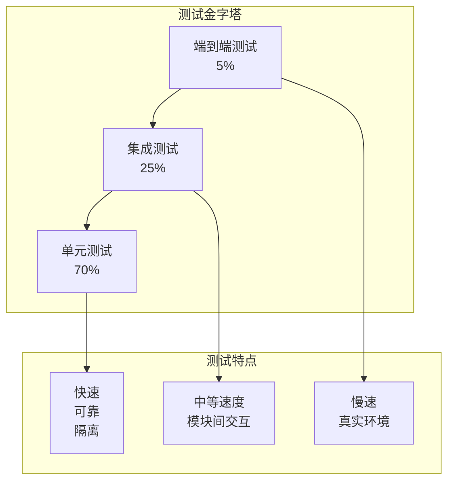

# 测试策略

## 概述

CodeViewX 采用多层次的测试策略，确保代码质量、功能正确性和系统稳定性。本文档详细介绍了测试框架、测试类型、测试策略和最佳实践。

## 测试架构

### 测试金字塔



### 测试分类

#### 按测试级别分类

1. **单元测试 (Unit Tests)**
   - 测试单个函数或方法
   - 快速执行，高覆盖率
   - 使用 Mock 隔离依赖

2. **集成测试 (Integration Tests)**
   - 测试模块间的交互
   - 测试工具链和外部服务
   - 使用真实数据和环境

3. **端到端测试 (E2E Tests)**
   - 测试完整的工作流程
   - 模拟真实用户场景
   - 验证系统整体功能

#### 按测试类型分类

1. **功能测试**: 验证功能正确性
2. **性能测试**: 验证性能指标
3. **安全测试**: 验证安全性
4. **兼容性测试**: 验证兼容性
5. **回归测试**: 防止功能回退

## 测试框架和工具

### 主要测试框架

```python
# pytest 配置 (pyproject.toml)
[tool.pytest.ini_options]
testpaths = ["tests"]
python_files = ["test_*.py"]
python_classes = ["Test*"]
python_functions = ["test_*"]
addopts = [
    "-v",
    "--strict-markers",
    "--tb=short",
    "--cov=codeviewx",
    "--cov-report=term-missing",
    "--cov-report=html:htmlcov",
    "--cov-fail-under=80"
]

markers = [
    "unit: 单元测试",
    "integration: 集成测试",
    "e2e: 端到端测试",
    "slow: 慢速测试",
    "external: 需要外部依赖的测试",
    "gpu: 需要 GPU 的测试"
]
```

### 测试工具栈

| 工具 | 用途 | 版本要求 |
|------|------|----------|
| **pytest** | 测试框架 | >= 7.0 |
| **pytest-cov** | 覆盖率测试 | >= 4.0 |
| **pytest-mock** | Mock 工具 | >= 3.10 |
| **pytest-asyncio** | 异步测试 | >= 0.21 |
| **pytest-xdist** | 并行测试 | >= 3.0 |
| **factory-boy** | 测试数据工厂 | >= 3.2 |
| **freezegun** | 时间模拟 | >= 1.2 |
| **responses** | HTTP 模拟 | >= 0.23 |
| **testcontainers** | 容器测试 | >= 3.7 |

## 单元测试

### 测试结构

```
tests/
├── unit/                           # 单元测试目录
│   ├── __init__.py
│   ├── test_cli.py                 # CLI 模块测试
│   ├── test_core.py                # 核心模块测试
│   ├── test_tools/                 # 工具模块测试
│   │   ├── __init__.py
│   │   ├── test_command.py         # 命令工具测试
│   │   ├── test_filesystem.py      # 文件系统工具测试
│   │   └── test_search.py          # 搜索工具测试
│   ├── test_utils/                 # 工具函数测试
│   │   ├── __init__.py
│   │   ├── test_language.py        # 语言检测测试
│   │   └── test_validation.py      # 验证函数测试
│   └── fixtures/                   # 测试数据
│       ├── __init__.py
│       ├── sample_files/           # 示例文件
│       └── data_factories.py       # 数据工厂
```

### 单元测试示例

#### 1. 核心功能测试

```python
# tests/unit/test_core.py
import pytest
from unittest.mock import Mock, patch, MagicMock
from pathlib import Path
import tempfile

from codeviewx.core import (
    detect_system_language,
    load_prompt,
    generate_docs
)

class TestLanguageDetection:
    """语言检测功能测试"""
    
    @patch('codeviewx.core.locale.getdefaultlocale')
    def test_detect_chinese_success(self, mock_locale):
        """测试中文语言检测成功"""
        mock_locale.return_value = ('zh_CN', 'UTF-8')
        
        result = detect_system_language()
        
        assert result == 'Chinese'
        mock_locale.assert_called_once()
    
    @patch('codeviewx.core.locale.getdefaultlocale')
    def test_detect_english_success(self, mock_locale):
        """测试英文语言检测成功"""
        mock_locale.return_value = ('en_US', 'UTF-8')
        
        result = detect_system_language()
        
        assert result == 'English'
    
    @patch('codeviewx.core.locale.getdefaultlocale')
    def test_detect_japanese_success(self, mock_locale):
        """测试日文语言检测成功"""
        mock_locale.return_value = ('ja_JP', 'UTF-8')
        
        result = detect_system_language()
        
        assert result == 'Japanese'
    
    @patch('codeviewx.core.locale.getdefaultlocale')
    def test_detect_fallback_on_error(self, mock_locale):
        """测试检测错误时的回退机制"""
        mock_locale.side_effect = Exception("模拟错误")
        
        result = detect_system_language()
        
        assert result == 'English'
    
    @patch('codeviewx.core.locale.getdefaultlocale')
    def test_detect_fallback_on_none(self, mock_locale):
        """测试 locale 返回 None 时的回退"""
        mock_locale.return_value = (None, None)
        
        result = detect_system_language()
        
        assert result == 'English'
    
    @patch('codeviewx.core.locale.getdefaultlocale')
    def test_detect_unknown_language(self, mock_locale):
        """测试未知语言时的回退"""
        mock_locale.return_value = ('xx_XX', 'UTF-8')
        
        result = detect_system_language()
        
        assert result == 'English'

class TestPromptLoading:
    """提示词加载功能测试"""
    
    def test_load_prompt_success(self, tmp_path):
        """测试成功加载提示词"""
        # 创建临时提示词文件
        prompt_file = tmp_path / "test_prompt.md"
        prompt_content = """
# 测试提示词

工作目录: {working_directory}
输出目录: {output_directory}
语言: {doc_language}
        """.strip()
        prompt_file.write_text(prompt_content)
        
        with patch('codeviewx.core.files') as mock_files:
            mock_files.return_value.joinpath.return_value.open.return_value.__enter__.return_value.read.return_value = prompt_content
            
            # 测试无变量加载
            result = load_prompt("test_prompt")
            assert "工作目录: {working_directory}" in result
            
            # 测试带变量加载
            result = load_prompt(
                "test_prompt",
                working_directory="/test/path",
                output_directory="docs",
                doc_language="Chinese"
            )
            assert "工作目录: /test/path" in result
            assert "输出目录: docs" in result
            assert "语言: Chinese" in result
    
    def test_load_prompt_with_missing_variable(self):
        """测试缺少必需变量时的错误处理"""
        with pytest.raises(ValueError, match="模板需要变量"):
            load_prompt("test_prompt", working_directory="/test")
    
    def test_load_prompt_file_not_found(self):
        """测试提示词文件不存在时的错误处理"""
        with pytest.raises(FileNotFoundError):
            load_prompt("nonexistent_prompt")

class TestGenerateDocs:
    """文档生成功能测试"""
    
    @pytest.fixture
    def mock_agent(self):
        """模拟 AI Agent"""
        agent = Mock()
        
        # 模拟流式返回
        mock_chunks = [
            {"messages": [Mock(tool_calls=[], content="开始分析")]},
            {"messages": [Mock(tool_calls=[], content="分析完成")]}
        ]
        agent.stream.return_value = iter(mock_chunks)
        
        return agent
    
    @pytest.fixture
    def temp_project(self):
        """创建临时测试项目"""
        with tempfile.TemporaryDirectory() as temp_dir:
            project_path = Path(temp_dir)
            
            # 创建项目结构
            (project_path / "src").mkdir()
            (project_path / "pyproject.toml").write_text("""
[project]
name = "test-project"
version = "1.0.0"
            """)
            
            (project_path / "src" / "main.py").write_text("""
def main():
    print("Hello, World!")
            """)
            
            yield project_path
    
    @patch('codeviewx.core.create_deep_agent')
    def test_generate_docs_success(self, mock_create_agent, mock_agent, temp_project):
        """测试成功生成文档"""
        mock_create_agent.return_value = mock_agent
        
        with tempfile.TemporaryDirectory() as output_dir:
            generate_docs(
                working_directory=str(temp_project),
                output_directory=output_dir,
                doc_language="English",
                verbose=False
            )
            
            # 验证 Agent 被正确创建
            mock_create_agent.assert_called_once()
            
            # 验证输出目录存在
            assert Path(output_dir).exists()
    
    @patch('codeviewx.core.create_deep_agent')
    def test_generate_docs_with_verbose(self, mock_create_agent, mock_agent, temp_project):
        """测试详细日志模式"""
        mock_create_agent.return_value = mock_agent
        
        with tempfile.TemporaryDirectory() as output_dir:
            generate_docs(
                working_directory=str(temp_project),
                output_directory=output_dir,
                verbose=True
            )
            
            # 验证详细日志配置
            mock_create_agent.assert_called_once()
```

#### 2. 工具函数测试

```python
# tests/unit/test_tools/test_filesystem.py
import pytest
import tempfile
import os
from pathlib import Path
from unittest.mock import patch, mock_open

from codeviewx.tools.filesystem import (
    read_real_file,
    write_real_file,
    list_real_directory
)

class TestFileSystemTools:
    """文件系统工具测试"""
    
    def test_read_real_file_success(self, tmp_path):
        """测试成功读取文件"""
        # 创建测试文件
        test_file = tmp_path / "test.txt"
        test_content = "测试内容\n第二行"
        test_file.write_text(test_content, encoding='utf-8')
        
        result = read_real_file(str(test_file))
        
        assert "测试内容" in result
        assert "第二行" in result
        assert str(test_file) in result
        assert "KB" in result
    
    def test_read_real_file_not_found(self):
        """测试文件不存在"""
        result = read_real_file("/nonexistent/file.txt")
        
        assert "❌ 错误: 文件" in result
        assert "不存在" in result
    
    def test_read_real_file_permission_error(self):
        """测试权限错误"""
        # 使用 Mock 模拟权限错误
        with pytest.raises(PermissionError):
            with patch('builtins.open', side_effect=PermissionError("权限不足")):
                read_real_file("/protected/file.txt")
    
    def test_write_real_file_success(self, tmp_path):
        """测试成功写入文件"""
        test_file = tmp_path / "subdir" / "test.txt"
        test_content = "# 测试文档\n\n这是测试内容。"
        
        result = write_real_file(str(test_file), test_content)
        
        # 验证返回消息
        assert "✅ 成功写入文件" in result
        assert str(test_file) in result
        
        # 验证文件实际写入
        assert test_file.exists()
        assert test_file.read_text(encoding='utf-8') == test_content
    
    def test_write_real_file_auto_create_directory(self, tmp_path):
        """测试自动创建目录"""
        nested_dir = tmp_path / "level1" / "level2" / "level3"
        test_file = nested_dir / "test.txt"
        
        write_real_file(str(test_file), "测试内容")
        
        assert nested_dir.exists()
        assert test_file.exists()
    
    def test_write_real_file_error(self):
        """测试写入错误"""
        with patch('builtins.open', side_effect=Exception("写入错误")):
            result = write_real_file("/invalid/path/file.txt", "内容")
            
            assert "❌ 写入文件失败" in result
            assert "写入错误" in result
    
    def test_list_real_directory_success(self, tmp_path):
        """测试成功列出目录"""
        # 创建测试目录结构
        (tmp_path / "file1.txt").touch()
        (tmp_path / "file2.py").touch()
        (tmp_path / "subdir").mkdir()
        (tmp_path / "subdir" / "nested.txt").touch()
        
        result = list_real_directory(str(tmp_path))
        
        assert "目录:" in result
        assert "文件:" in result
        assert "file1.txt" in result
        assert "file2.py" in result
        assert "subdir/" in result
        assert "共 1 个目录, 2 个文件" in result
    
    def test_list_real_directory_empty(self, tmp_path):
        """测试列出空目录"""
        result = list_real_directory(str(tmp_path))
        
        assert "目录为空" in result or "共 0 个目录, 0 个文件" in result
    
    def test_list_real_directory_not_found(self):
        """测试目录不存在"""
        result = list_real_directory("/nonexistent/directory")
        
        assert "❌ 错误: 目录" in result
        assert "不存在" in result
```

#### 3. 搜索工具测试

```python
# tests/unit/test_tools/test_search.py
import pytest
from unittest.mock import Mock, patch

from codeviewx.tools.search import ripgrep_search

class TestSearchTool:
    """搜索工具测试"""
    
    @patch('codeviewx.tools.search.Ripgrepy')
    def test_ripgrep_search_success(self, mock_ripgrepy):
        """测试成功搜索"""
        # 模拟 ripgrep 响应
        mock_rg = Mock()
        mock_rg.line_number.return_value = mock_rg
        mock_rg.with_filename.return_value = mock_rg
        mock_rg.max_count.return_value = mock_rg
        mock_rg.ignore_case.return_value = mock_rg
        mock_rg.type_add.return_value = mock_rg
        mock_rg.glob.return_value = mock_rg
        
        mock_result = Mock()
        mock_result.run.return_value.as_string = "file1.py:10:def test_function():"
        mock_rg.return_value = mock_result
        
        result = ripgrep_search("def test", ".", "py", ignore_case=True, max_count=50)
        
        assert "file1.py" in result
        assert "10" in result
        assert "def test_function" in result
        
        # 验证 ripgrep 调用
        mock_ripgrepy.assert_called_once_with("def test", ".")
        mock_rg.line_number.assert_called_once()
        mock_rg.with_filename.assert_called_once()
        mock_rg.max_count.assert_called_once_with(50)
        mock_rg.ignore_case.assert_called_once()
        mock_rg.type_add.assert_called_once_with("py")
    
    @patch('codeviewx.tools.search.Ripgrepy')
    def test_ripgrep_search_no_results(self, mock_ripgrepy):
        """测试无搜索结果"""
        mock_rg = Mock()
        mock_rg.line_number.return_value = mock_rg
        mock_rg.with_filename.return_value = mock_rg
        mock_rg.max_count.return_value = mock_rg
        
        mock_result = Mock()
        mock_result.run.return_value.as_string = ""
        mock_rg.return_value = mock_result
        
        result = ripgrep_search("nonexistent_pattern", ".")
        
        assert "未找到匹配 'nonexistent_pattern' 的内容" in result
    
    @patch('codeviewx.tools.search.Ripgrepy')
    def test_ripgrep_search_ripgrep_not_installed(self, mock_ripgrepy):
        """测试 ripgrep 未安装"""
        mock_ripgrepy.side_effect = Exception("rg: command not found")
        
        result = ripgrep_search("pattern", ".")
        
        assert "错误: ripgrep (rg) 未安装" in result
        assert "brew install ripgrep" in result
    
    @patch('codeviewx.tools.search.Ripgrepy')
    def test_ripgrep_search_general_error(self, mock_ripgrepy):
        """测试一般错误"""
        mock_ripgrepy.side_effect = Exception("一般错误")
        
        result = ripgrep_search("pattern", ".")
        
        assert "搜索错误: 一般错误" in result
    
    @patch('codeviewx.tools.search.Ripgrepy')
    def test_ripgrep_search_with_long_result(self, mock_ripgrepy):
        """测试长结果截断"""
        mock_rg = Mock()
        mock_rg.line_number.return_value = mock_rg
        mock_rg.with_filename.return_value = mock_rg
        mock_rg.max_count.return_value = mock_rg
        
        # 模拟长结果
        long_result = "\n".join([f"file{i}.py:{i}:line {i}" for i in range(150)])
        mock_result = Mock()
        mock_result.run.return_value.as_string = long_result
        mock_rg.return_value = mock_result
        
        result = ripgrep_search("pattern", ".", max_count=100)
        
        assert "... (结果太多，已截断到前 100 行)" in result
```

## 集成测试

### 测试结构

```
tests/
├── integration/                     # 集成测试目录
│   ├── __init__.py
│   ├── test_full_workflow.py       # 完整工作流测试
│   ├── test_web_server.py          # Web 服务器测试
│   ├── test_cli_integration.py     # CLI 集成测试
│   ├── test_agent_integration.py   # Agent 集成测试
│   └── fixtures/                   # 测试数据
│       ├── sample_projects/        # 示例项目
│       └── expected_outputs/       # 预期输出
```

### 集成测试示例

#### 1. 完整工作流测试

```python
# tests/integration/test_full_workflow.py
import pytest
import tempfile
import os
import json
from pathlib import Path
import time

from codeviewx import generate_docs, start_document_web_server
from codeviewx.tools import ripgrep_search, read_real_file

@pytest.mark.integration
@pytest.mark.slow
class TestFullWorkflow:
    """完整工作流集成测试"""
    
    @pytest.fixture
    def sample_python_project(self):
        """创建示例 Python 项目"""
        with tempfile.TemporaryDirectory() as temp_dir:
            project_path = Path(temp_dir) / "sample_project"
            project_path.mkdir()
            
            # 创建项目结构
            (project_path / "src").mkdir()
            (project_path / "tests").mkdir()
            (project_path / "docs").mkdir()
            
            # 创建配置文件
            (project_path / "pyproject.toml").write_text("""
[build-system]
requires = ["setuptools>=45", "wheel"]
build-backend = "setuptools.build_meta"

[project]
name = "sample-project"
version = "1.0.0"
description = "示例项目"
authors = [{name = "Test Author"}]
license = {text = "MIT"}
dependencies = [
    "requests>=2.25.0",
    "click>=8.0.0"
]

[project.scripts]
sample-cli = "sample.main:main"
            """)
            
            (project_path / "requirements.txt").write_text("""
requests==2.28.1
click==8.1.0
pytest==7.0.0
            """)
            
            # 创建源代码
            (project_path / "src" / "sample").mkdir()
            (project_path / "src" / "sample" / "__init__.py").write_text('"""Sample package"""')
            (project_path / "src" / "sample" / "main.py").write_text("""
#!/usr/bin/env python3
\"\"\"
示例项目主模块
\"\"\"

import click
from .core import process_data


@click.command()
@click.option('--input', '-i', required=True, help='输入文件')
@click.option('--output', '-o', help='输出文件')
@click.option('--verbose', '-v', is_flag=True, help='详细输出')
def main(input, output, verbose):
    \"\"\"主函数\"\"\"
    if verbose:
        click.echo(f"处理文件: {input}")
    
    result = process_data(input)
    
    if output:
        with open(output, 'w') as f:
            f.write(result)
        click.echo(f"结果已保存到: {output}")
    else:
        click.echo(result)


if __name__ == '__main__':
    main()
            """)
            
            (project_path / "src" / "sample" / "core.py").write_text("""
\"\"\"
核心处理模块
\"\"\"

import json
from typing import Dict, Any


class DataProcessor:
    \"\"\"数据处理器\"\"\"
    
    def __init__(self, config: Dict[str, Any] = None):
        self.config = config or {}
    
    def process(self, data: str) -> str:
        \"\"\"处理数据\"\"\"
        lines = data.strip().split('\\n')
        processed = [f"Line {i+1}: {line}" for i, line in enumerate(lines)]
        return '\\n'.join(processed)
    
    def analyze(self, data: str) -> Dict[str, Any]:
        \"\"\"分析数据\"\"\"
        return {
            'line_count': len(data.split('\\n')),
            'char_count': len(data),
            'word_count': len(data.split())
        }


def process_data(file_path: str) -> str:
    \"\"\"处理数据文件\"\"\"
    processor = DataProcessor()
    
    with open(file_path, 'r', encoding='utf-8') as f:
        content = f.read()
    
    return processor.process(content)
            """)
            
            # 创建测试文件
            (project_path / "tests" / "test_core.py").write_text("""
import pytest
from sample.core import DataProcessor, process_data


class TestDataProcessor:
    \"\"\"数据处理器测试\"\"\"
    
    def test_process(self):
        processor = DataProcessor()
        result = processor.process("line1\\nline2")
        assert "Line 1: line1" in result
        assert "Line 2: line2" in result
    
    def test_analyze(self):
        processor = DataProcessor()
        result = processor.analyze("hello world")
        assert result['word_count'] == 2
                """)
            
            # 创建 README
            (project_path / "README.md").write_text("""
# Sample Project

这是一个示例项目，用于测试 CodeViewX 的文档生成功能。

## 功能特性

- 数据处理
- 命令行接口
- 完整的测试覆盖

## 安装

```bash
pip install -e .
```

## 使用

```bash
sample-cli -i input.txt -o output.txt -v
```

## 开发

```bash
pytest tests/
```
            """)
            
            # 创建示例数据文件
            (project_path / "sample_data.txt").write_text("""
第一行数据
第二行数据
第三行数据
            """)
            
            yield project_path
    
    def test_end_to_end_document_generation(self, sample_python_project):
        """端到端文档生成测试"""
        with tempfile.TemporaryDirectory() as output_dir:
            # 生成文档
            generate_docs(
                working_directory=str(sample_python_project),
                output_directory=output_dir,
                doc_language="Chinese",
                verbose=False
            )
            
            output_path = Path(output_dir)
            
            # 验证生成的文件
            generated_files = list(output_path.glob("*.md"))
            assert len(generated_files) >= 5  # 至少应该有5个文档文件
            
            # 验证关键文件存在
            assert (output_path / "README.md").exists()
            assert (output_path / "01-overview.md").exists()
            assert (output_path / "02-quickstart.md").exists()
            
            # 验证文档内容
            readme_content = (output_path / "README.md").read_text(encoding='utf-8')
            assert "Sample Project" in readme_content
            assert "技术文档" in readme_content
            
            overview_content = (output_path / "01-overview.md").read_text(encoding='utf-8')
            assert "Python" in overview_content
            assert "requests" in overview_content
            assert "click" in overview_content
    
    @pytest.mark.external
    def test_documentation_quality(self, sample_python_project):
        """文档质量测试"""
        with tempfile.TemporaryDirectory() as output_dir:
            generate_docs(
                working_directory=str(sample_python_project),
                output_directory=output_dir,
                doc_language="Chinese",
                verbose=False
            )
            
            output_path = Path(output_dir)
            
            # 检查文档结构完整性
            required_files = [
                "README.md",
                "01-overview.md",
                "02-quickstart.md",
                "03-architecture.md",
                "04-core-mechanisms.md"
            ]
            
            for file_name in required_files:
                file_path = output_path / file_name
                assert file_path.exists(), f"缺少必需文件: {file_name}"
                
                content = file_path.read_text(encoding='utf-8')
                
                # 验证文档质量
                assert len(content) > 500, f"{file_name} 内容太短"
                assert "##" in content, f"{file_name} 缺少二级标题"
    
    def test_multilingual_document_generation(self, sample_python_project):
        """多语言文档生成测试"""
        languages = ["Chinese", "English"]
        
        for language in languages:
            with tempfile.TemporaryDirectory() as output_dir:
                generate_docs(
                    working_directory=str(sample_python_project),
                    output_directory=output_dir,
                    doc_language=language,
                    verbose=False
                )
                
                output_path = Path(output_dir)
                readme_content = (output_path / "README.md").read_text(encoding='utf-8')
                
                # 验证语言特定内容
                if language == "Chinese":
                    assert "技术文档" in readme_content
                    assert "项目概述" in readme_content
                elif language == "English":
                    assert "Technical Documentation" in readme_content
                    assert "Project Overview" in readme_content

@pytest.mark.integration
class TestWebServerIntegration:
    """Web 服务器集成测试"""
    
    @pytest.fixture
    def sample_docs(self):
        """创建示例文档"""
        with tempfile.TemporaryDirectory() as docs_dir:
            docs_path = Path(docs_dir)
            
            # 创建示例文档
            (docs_path / "README.md").write_text("""
# 示例文档

这是一个示例文档。

## 章节1

内容1

## 章节2

内容2
            """)
            
            (docs_path / "guide.md").write_text("""
# 用户指南

## 安装

安装说明...

## 使用

使用说明...
            """)
            
            yield docs_path
    
    @pytest.mark.slow
    def test_web_server_startup_and_access(self, sample_docs):
        """测试 Web 服务器启动和访问"""
        import threading
        import requests
        import time
        
        # 在单独线程中启动服务器
        server_thread = threading.Thread(
            target=start_document_web_server,
            args=(str(sample_docs),),
            daemon=True
        )
        
        try:
            server_thread.start()
            
            # 等待服务器启动
            time.sleep(2)
            
            # 测试访问首页
            response = requests.get("http://127.0.0.1:5000", timeout=10)
            assert response.status_code == 200
            assert "示例文档" in response.text
            assert "章节1" in response.text
            
            # 测试访问特定文档
            response = requests.get("http://127.0.0.1:5000/guide.md", timeout=10)
            assert response.status_code == 200
            assert "用户指南" in response.text
            
        except requests.exceptions.ConnectionError:
            pytest.skip("Web 服务器连接失败，可能端口被占用")
        finally:
            # 服务器会在程序退出时自动关闭
            pass
```

## 测试数据工厂

### 使用 Factory Boy

```python
# tests/unit/fixtures/data_factories.py
import factory
from pathlib import Path
from typing import Dict, Any

class ProjectFactory(factory.Factory):
    """项目数据工厂"""
    
    class Meta:
        model = dict
    
    class Params:
        with_python = True
        with_javascript = False
        with_tests = True
    
    name = factory.Faker('word')
    version = "1.0.0"
    description = factory.Faker('sentence')
    
    @factory.lazy_attribute
    def structure(self):
        """生成项目结构"""
        structure = {
            'pyproject.toml': self._generate_pyproject(),
            'README.md': f"# {self.name}\n\n{self.description}"
        }
        
        if self.with_python:
            structure.update({
                'src/__init__.py': '"""Source package"""',
                'src/main.py': self._generate_main_module(),
                'src/core.py': self._generate_core_module(),
            })
        
        if self.with_javascript:
            structure.update({
                'package.json': self._generate_package_json(),
                'src/index.js': self._generate_js_main(),
                'src/app.js': self._generate_js_app(),
            })
        
        if self.with_tests:
            structure.update({
                'tests/__init__.py': '',
                'tests/test_main.py': self._generate_test_module(),
            })
        
        return structure
    
    def _generate_pyproject(self):
        return f"""
[project]
name = "{self.name}"
version = "{self.version}"
description = "{self.description}"
dependencies = [
    "requests>=2.25.0"
]
        """.strip()
    
    def _generate_main_module(self):
        return f"""
def main():
    print("{self.name} v{self.version}")

if __name__ == "__main__":
    main()
        """.strip()
    
    def _generate_core_module(self):
        return """
class Core:
    def process(self, data):
        return data.upper()
        """.strip()
    
    def _generate_package_json(self):
        return f"""
{{
  "name": "{self.name}",
  "version": "{self.version}",
  "description": "{self.description}",
  "dependencies": {{
    "express": "^4.18.0"
  }}
}}
        """.strip()
    
    def _generate_js_main(self):
        return f"""
console.log("{self.name} v{self.version}");
        """.strip()
    
    def _generate_js_app(self):
        return """
class App {
    constructor() {
        this.name = "Express App";
    }
    
    start() {
        console.log(`${this.name} started`);
    }
}
        """.strip()
    
    def _generate_test_module(self):
        return """
import pytest
from src.main import main

def test_main():
    # 测试主函数
    assert main() is None  # main 函数只打印，没有返回值
        """.strip()

# 使用示例
def create_temp_project(factory_kwargs: Dict[str, Any] = None) -> Path:
    """创建临时项目"""
    import tempfile
    
    with tempfile.TemporaryDirectory() as temp_dir:
        project_path = Path(temp_dir)
        project_data = ProjectFactory(**(factory_kwargs or {}))
        
        # 创建目录结构
        for file_path, content in project_data.structure.items():
            full_path = project_path / file_path
            full_path.parent.mkdir(parents=True, exist_ok=True)
            full_path.write_text(content, encoding='utf-8')
        
        yield project_path
```

## 性能测试

### 性能基准测试

```python
# tests/performance/test_benchmarks.py
import pytest
import time
import tempfile
from pathlib import Path

from codeviewx import generate_docs
from tests.unit.fixtures.data_factories import create_temp_project

@pytest.mark.performance
@pytest.mark.slow
class TestPerformanceBenchmarks:
    """性能基准测试"""
    
    @pytest.mark.parametrize("project_size", ["small", "medium", "large"])
    def test_document_generation_performance(self, project_size):
        """文档生成性能测试"""
        
        size_configs = {
            "small": {"num_files": 10, "num_lines": 50},
            "medium": {"num_files": 50, "num_lines": 200},
            "large": {"num_files": 200, "num_lines": 500}
        }
        
        config = size_configs[project_size]
        
        # 创建测试项目
        with create_temp_project() as project_path:
            self._create_project_files(project_path, **config)
            
            with tempfile.TemporaryDirectory() as output_dir:
                # 测量执行时间
                start_time = time.time()
                
                generate_docs(
                    working_directory=str(project_path),
                    output_directory=output_dir,
                    doc_language="English",
                    verbose=False
                )
                
                end_time = time.time()
                execution_time = end_time - start_time
                
                # 性能断言
                max_time = {
                    "small": 30,    # 小项目30秒内
                    "medium": 120,  # 中等项目2分钟内
                    "large": 300    # 大项目5分钟内
                }
                
                assert execution_time < max_time[project_size], \
                    f"{project_size} 项目生成时间 {execution_time:.2f}s 超过限制 {max_time[project_size]}s"
                
                print(f"{project_size} 项目文档生成时间: {execution_time:.2f}s")
    
    def _create_project_files(self, project_path: Path, num_files: int, num_lines: int):
        """创建测试项目文件"""
        for i in range(num_files):
            file_path = project_path / "src" / f"module_{i}.py"
            file_path.parent.mkdir(parents=True, exist_ok=True)
            
            content = f"""
# Module {i}

class Class{i}:
    \"\"\"类 {i}\"\"\"
    
    def __init__(self):
        self.value = {i}
    
    def method_{i}(self):
        \"\"\"方法 {i}\"\"\"
        return self.value * 2
    
    def complex_method(self, data):
        \"\"\"复杂方法\"\"\"
        result = []
        for item in data:
            if item > 0:
                result.append(item * self.value)
            else:
                result.append(item // self.value if self.value != 0 else 0)
        return result

def function_{i}(param1, param2=None):
    \"\"\"函数 {i}\"\"\"
    if param2 is None:
        param2 = []
    
    result = []
    for i in range(param1):
        result.extend(param2)
    
    return result

"""
            
            # 添加更多行以增加文件大小
            extra_lines = f"""
# 生成更多内容
lines = [
    "这是第 {{i}} 行的内容",
    "包含一些示例数据",
    "用于测试性能",
]

for i, line in enumerate(lines):
    processed_line = f"{{i}}: {{line}}"
    print(processed_line)
""" * (num_lines // 20)
            
            file_path.write_text(content + extra_lines, encoding='utf-8')

@pytest.mark.performance
class TestMemoryUsage:
    """内存使用测试"""
    
    def test_memory_usage_during_generation(self):
        """文档生成过程中的内存使用测试"""
        import psutil
        import os
        
        process = psutil.Process(os.getpid())
        initial_memory = process.memory_info().rss / 1024 / 1024  # MB
        
        with create_temp_project({"with_python": True}) as project_path:
            with tempfile.TemporaryDirectory() as output_dir:
                generate_docs(
                    working_directory=str(project_path),
                    output_directory=output_dir,
                    doc_language="English",
                    verbose=False
                )
                
                final_memory = process.memory_info().rss / 1024 / 1024  # MB
                memory_increase = final_memory - initial_memory
                
                # 内存增长不应超过 500MB
                assert memory_increase < 500, \
                    f"内存使用增长 {memory_increase:.2f}MB 超过限制 500MB"
                
                print(f"内存使用增长: {memory_increase:.2f}MB")
```

## 测试配置和运行

### 运行特定测试

```bash
# 运行所有单元测试
pytest tests/unit/ -v

# 运行所有集成测试
pytest tests/integration/ -v

# 运行性能测试
pytest tests/performance/ -v -m performance

# 运行慢速测试
pytest -m slow

# 并行运行测试
pytest -n auto

# 运行特定测试文件
pytest tests/unit/test_core.py -v

# 运行特定测试函数
pytest tests/unit/test_core.py::TestLanguageDetection::test_detect_chinese_success -v

# 生成覆盖率报告
pytest --cov=codeviewx --cov-report=html

# 运行测试并生成 JUnit XML 报告
pytest --junitxml=test-results.xml
```

### CI/CD 配置

#### GitHub Actions

```yaml
# .github/workflows/test.yml
name: Tests

on:
  push:
    branches: [ main, develop ]
  pull_request:
    branches: [ main ]

jobs:
  test:
    runs-on: ubuntu-latest
    strategy:
      matrix:
        python-version: [3.8, 3.9, "3.10", "3.11"]

    steps:
    - uses: actions/checkout@v3
    
    - name: Set up Python ${{ matrix.python-version }}
      uses: actions/setup-python@v4
      with:
        python-version: ${{ matrix.python-version }}
    
    - name: Install dependencies
      run: |
        python -m pip install --upgrade pip
        pip install -e ".[dev]"
    
    - name: Install ripgrep
      run: sudo apt-get install -y ripgrep
    
    - name: Run unit tests
      run: |
        pytest tests/unit/ -v --cov=codeviewx --cov-report=xml
    
    - name: Upload coverage to Codecov
      uses: codecov/codecov-action@v3
      with:
        file: ./coverage.xml
        flags: unittests
        name: codecov-umbrella
    
    - name: Run integration tests
      run: |
        pytest tests/integration/ -v -m "not external"
      env:
        ANTHROPIC_API_KEY: ${{ secrets.ANTHROPIC_API_KEY }}
```

## 测试最佳实践

### 1. 测试命名规范

```python
# 好的测试命名
def test_detect_chinese_language_with_valid_locale():
    """测试使用有效区域设置检测中文语言"""
    pass

def test_filesystem_write_creates_nested_directories():
    """测试文件系统写入创建嵌套目录"""
    pass

# 避免的命名
def test_1():
    """测试1"""
    pass

def test_function():
    """测试函数"""
    pass
```

### 2. 测试结构 (AAA 模式)

```python
def test_function_with_valid_input():
    # Arrange (准备)
    input_data = "valid input"
    expected_output = "expected result"
    
    # Act (执行)
    result = function_under_test(input_data)
    
    # Assert (断言)
    assert result == expected_output
```

### 3. 测试数据管理

```python
# 使用 fixtures 管理测试数据
@pytest.fixture
def valid_config():
    return {
        "name": "test_project",
        "version": "1.0.0",
        "dependencies": ["requests"]
    }

# 使用工厂创建测试数据
def test_with_factory_created_data():
    project = ProjectFactory(name="test", with_python=True)
    # 使用 project 进行测试
```

### 4. Mock 使用原则

```python
# 只 Mock 外部依赖
@patch('codeviewx.core.create_deep_agent')
def test_generate_docs_with_mocked_agent(self, mock_create_agent):
    # Mock 外部 AI Agent
    mock_agent = Mock()
    mock_create_agent.return_value = mock_agent
    
    # 测试业务逻辑
    generate_docs()
    
    # 验证交互
    mock_create_agent.assert_called_once()

# 避免 Mock 被测试的代码
def test_function_without_mock():
    # 直接测试函数逻辑
    result = function_under_test(real_data)
    assert result == expected
```

### 5. 测试隔离

```python
# 每个测试使用独立的临时目录
def test_with_temp_directory(self):
    with tempfile.TemporaryDirectory() as temp_dir:
        # 在 temp_dir 中进行测试
        pass

# 清理副作用
def test_with_cleanup(self):
    # 设置测试
    original_value = some_global_value
    some_global_value = "test_value"
    
    try:
        # 执行测试
        result = function_under_test()
        assert result == "expected"
    finally:
        # 清理
        some_global_value = original_value
```

## 测试报告和监控

### 覆盖率报告

```bash
# 生成 HTML 覆盖率报告
pytest --cov=codeviewx --cov-report=html

# 查看报告
open htmlcov/index.html

# 生成 XML 报告（用于 CI）
pytest --cov=codeviewx --cov-report=xml
```

### 性能监控

```python
# 在测试中添加性能监控
import time
import functools

def monitor_performance(func):
    @functools.wraps(func)
    def wrapper(*args, **kwargs):
        start_time = time.time()
        result = func(*args, **kwargs)
        end_time = time.time()
        
        print(f"{func.__name__} 执行时间: {end_time - start_time:.2f}s")
        return result
    return wrapper

@monitor_performance
def test_slow_operation():
    # 慢速操作测试
    pass
```

通过这套完整的测试策略，CodeViewX 能够确保代码质量、功能正确性和系统稳定性，为用户提供可靠的文档生成服务。