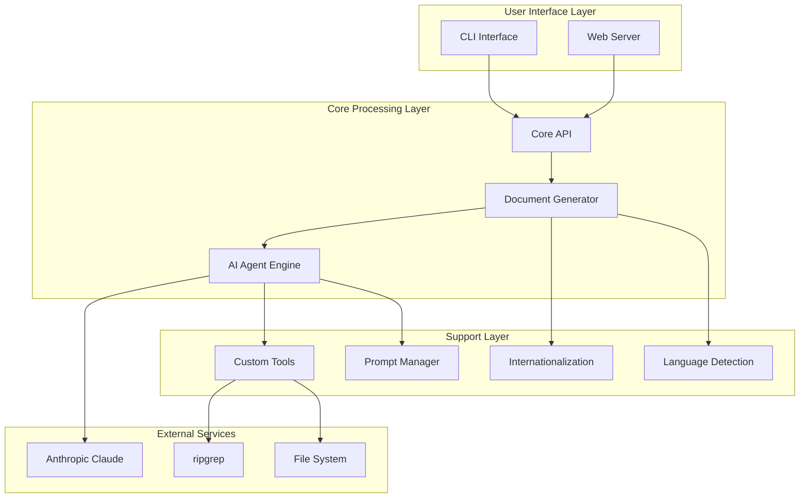
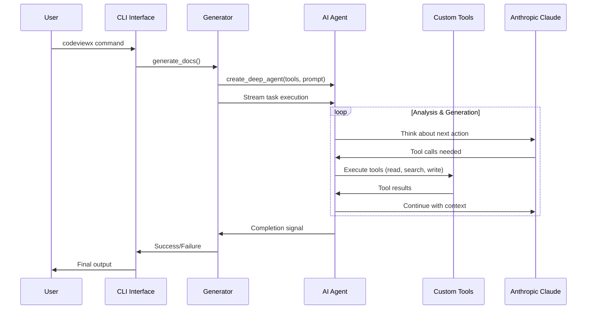
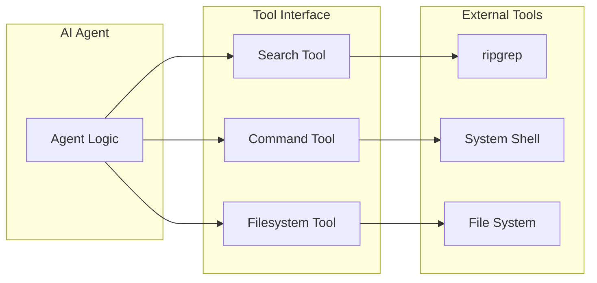
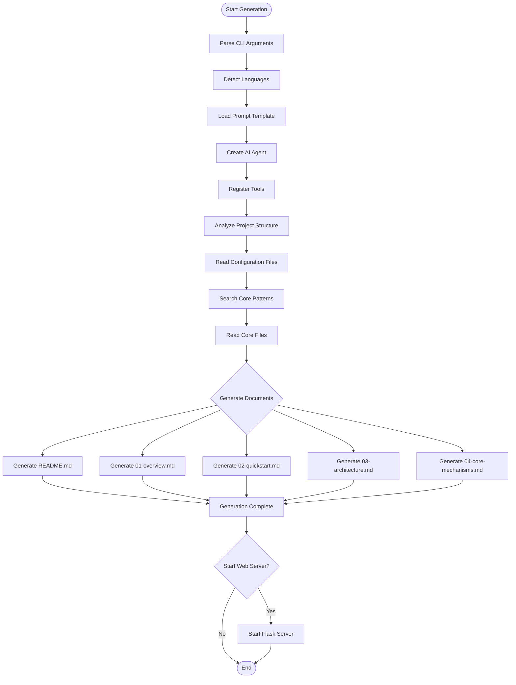
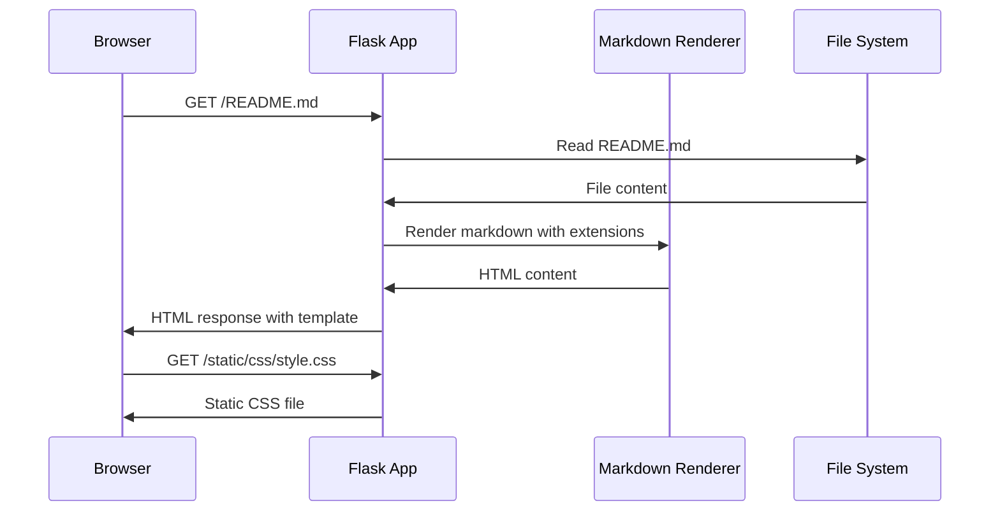
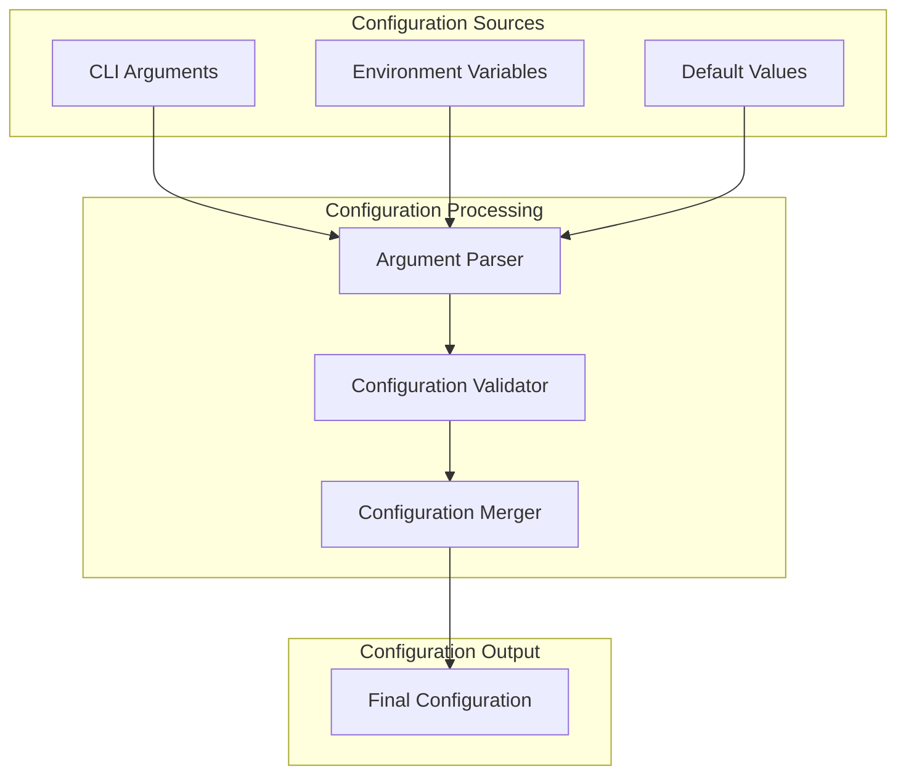
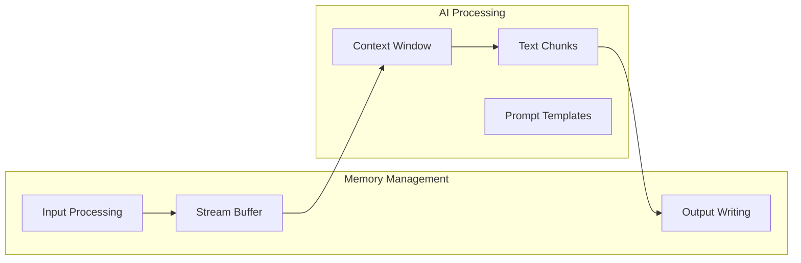
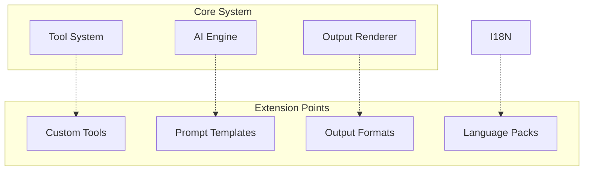

# System Architecture

## Architecture Overview

CodeViewX follows a modular, layered architecture that separates concerns between AI processing, user interface, and core functionality. The system is designed around the principle of using AI agents as the primary driver for documentation generation, with supporting modules for file operations, web serving, and user interaction.

## High-Level Architecture



## Core Components

### 1. CLI Interface (`cli.py`)

**Purpose**: Command-line interface for user interaction
**Key Functions**:
- Argument parsing and validation
- User interface language detection
- Workflow orchestration
- Error handling and user feedback

```python
# File: codeviewx/cli.py | Lines: 16-134 | Description: Main CLI entry point
def main():
    ui_lang = detect_ui_language()
    get_i18n().set_locale(ui_lang)
    
    parser = argparse.ArgumentParser(
        prog="codeviewx",
        description=t('cli_description'),
        # ... argument definitions
    )
```

### 2. Document Generator (`generator.py`)

**Purpose**: Core documentation generation engine
**Key Functions**:
- AI agent creation and management
- Documentation workflow orchestration
- Progress tracking and logging
- File output management

```python
# File: codeviewx/generator.py | Lines: 24-324 | Description: Main generation function
def generate_docs(
    working_directory: Optional[str] = None,
    output_directory: str = "docs",
    doc_language: Optional[str] = None,
    ui_language: Optional[str] = None,
    recursion_limit: int = 1000,
    verbose: bool = False
) -> None:
```

### 3. Web Server (`server.py`)

**Purpose**: Documentation browsing interface
**Key Functions**:
- Flask web application
- Markdown rendering with extensions
- File tree generation
- Static asset serving

```python
# File: codeviewx/server.py | Lines: 105-190 | Description: Web server startup
def start_document_web_server(output_directory):
    app = Flask(__name__, template_folder=template_dir, static_folder=static_dir)
    
    @app.route("/")
    def home():
        return index("README.md")
```

### 4. Internationalization (`i18n.py`)

**Purpose**: Multi-language support system
**Key Functions**:
- Message translation
- Locale detection
- Language switching
- UI string management

```python
# File: codeviewx/i18n.py | Lines: 200-325 | Description: I18n class implementation
class I18n:
    def __init__(self, locale: str = 'en'):
        self.locale = locale if locale in MESSAGES else 'en'
    
    def t(self, key: str, **kwargs) -> str:
        msg = MESSAGES.get(self.locale, {}).get(key, key)
        return msg.format(**kwargs) if kwargs else msg
```

## AI Agent Architecture

### Agent Design Pattern

CodeViewX uses the DeepAgents framework to create AI agents that can use tools for code analysis and document generation.



### Tool System Architecture

The tool system provides AI agents with capabilities to interact with the file system and execute commands.



**Tool Implementations**:

```python
# File: codeviewx/tools/command.py | Description: System command execution
def execute_command(command: str, working_dir: str = None) -> str:
    """Execute system command and return result"""

# File: codeviewx/tools/search.py | Description: Code searching with ripgrep  
def ripgrep_search(pattern: str, path: str = ".", 
                   file_type: str = None, 
                   ignore_case: bool = False,
                   max_count: int = 100) -> str:
    """Search for text patterns in files using ripgrep"""

# File: codeviewx/tools/filesystem.py | Description: File operations
def write_real_file(file_path: str, content: str) -> str:
    """Write file to real filesystem"""

def read_real_file(file_path: str) -> str:
    """Read file content from real filesystem"""

def list_real_directory(directory: str = ".") -> str:
    """List directory contents in real filesystem"""
```

## Data Flow Architecture

### Documentation Generation Flow



### Web Server Request Flow



## Configuration Architecture

### Configuration Sources (Priority Order)

1. **Command Line Arguments** - Highest priority
2. **Environment Variables** - Medium priority  
3. **Default Values** - Lowest priority



## Error Handling Architecture

### Exception Handling Strategy

```python
# File: codeviewx/cli.py | Lines: 108-126 | Description: CLI error handling
try:
    # Main execution logic
    if args.serve:
        start_document_web_server(args.output_directory)
    else:
        generate_docs(...)
        
except KeyboardInterrupt:
    print("\n\n⚠️  User interrupted", file=sys.stderr)
    sys.exit(130)
except Exception as e:
    print(f"\n❌ Error: {e}", file=sys.stderr)
    if args.verbose:
        import traceback
        traceback.print_exc()
    sys.exit(1)
```

### Error Recovery Mechanisms

1. **Graceful Degradation**: Continue with partial functionality when possible
2. **User Guidance**: Provide clear error messages and solutions
3. **Debug Mode**: Verbose logging for troubleshooting
4. **Safe Defaults**: Fallback to default configurations

## Performance Architecture

### Optimization Strategies

1. **Streaming Processing**: Process documentation generation in chunks
2. **Lazy Loading**: Load files and resources only when needed
3. **Caching**: Cache file system operations and search results
4. **Parallel Processing**: Execute independent operations concurrently

### Memory Management



## Security Architecture

### Security Considerations

1. **Input Validation**: Validate all user inputs and file paths
2. **Sandboxing**: Limit AI agent tool access to specified directories
3. **API Key Protection**: Secure handling of API credentials
4. **File Access Control**: Restrict file system access patterns

### Security Implementation

```python
# File: codeviewx/tools/filesystem.py | Security controls in file operations
def write_real_file(file_path: str, content: str) -> str:
    # Path validation and sanitization
    # Output directory restriction
    # Content validation
```

## Extensibility Architecture

### Plugin System Design

CodeViewX is designed to be extensible through:

1. **Custom Tools**: Add new tools for AI agents
2. **Prompt Templates**: Modify AI behavior through prompts
3. **Output Formats**: Support new documentation formats
4. **Language Support**: Add new languages for internationalization

### Extension Points



---

*Next: [Core Mechanisms](04-core-mechanisms.md) - Deep dive into implementation details*