# System Architecture

## Overview

CodeViewX follows a modular, layered architecture that combines AI-driven analysis with traditional software engineering principles. The system is designed to be extensible, maintainable, and efficient while providing powerful documentation generation capabilities.

## High-Level Architecture

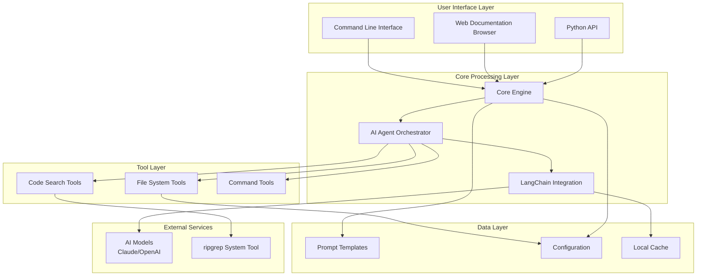

## Component Architecture

### 1. User Interface Layer

The interface layer provides multiple ways to interact with CodeViewX:

#### Command Line Interface (CLI)
- **File**: `codeviewx/cli.py`
- **Framework**: argparse
- **Responsibilities**: 
  - Command parsing and validation
  - Argument processing
  - Error handling and user feedback
  - Mode selection (generate vs. serve)

```python
# File: codeviewx/cli.py | Line: 15-30 | Description: CLI main function
def main():
    """命令行入口函数"""
    parser = argparse.ArgumentParser(
        prog="codeviewx",
        description="CodeViewX - AI 驱动的代码文档生成器",
        formatter_class=argparse.RawDescriptionHelpFormatter,
        # ... argument setup
    )
```

#### Web Documentation Browser
- **File**: `codeviewx/core.py` (routes section)
- **Framework**: Flask
- **Template Engine**: Jinja2
- **Responsibilities**:
  - Document rendering and display
  - File tree navigation
  - Markdown to HTML conversion
  - Static asset serving

```python
# File: codeviewx/core.py | Line: 33-37 | Description: Web server routes
@app.route("/")
def home():
    return index("README.md")

@app.route("/<path:filename>")
def index(filename):
    # Document rendering logic
```

#### Python API
- **File**: `codeviewx/__init__.py`
- **Framework**: Native Python
- **Responsibilities**:
  - Programmatic access
  - Integration support
  - Function exports

### 2. Core Processing Layer

The core layer contains the main business logic and orchestration:

#### Core Engine
- **File**: `codeviewx/core.py`
- **Key Functions**:
  - `generate_docs()`: Main documentation generation orchestrator
  - `start_document_web_server()`: Web server initialization
  - `detect_system_language()`: Automatic language detection
  - `load_prompt()`: Prompt template management

#### AI Agent Orchestrator
- **Framework**: DeepAgents
- **Integration**: LangChain
- **Responsibilities**:
  - Tool coordination
  - Workflow management
  - Context maintenance
  - Decision making

```python
# File: codeviewx/core.py | Line: 312-330 | Description: Agent creation
# Create Agent
agent = create_deep_agent(tools, prompt)
print("✓ 已创建 AI Agent")
print(f"✓ 已注册 {len(tools)} 个自定义工具: {', '.join([t.__name__ for t in tools])}")
```

#### LangChain Integration
- **Components**:
  - PromptTemplate for dynamic prompt formatting
  - Message handling for AI communication
  - Tool binding for agent capabilities

### 3. Tool Layer

The tool layer provides specialized capabilities for the AI agent:

#### File System Tools (`tools/filesystem.py`)
- **Functions**:
  - `write_real_file()`: File writing with directory creation
  - `read_real_file()`: File reading with metadata
  - `list_real_directory()`: Directory listing with categorization

```python
# File: codeviewx/tools/filesystem.py | Line: 20-35 | Description: File writing tool
def write_real_file(file_path: str, content: str) -> str:
    """写入真实文件系统中的文件"""
    try:
        # 确保目录存在
        directory = os.path.dirname(file_path)
        if directory and not os.path.exists(directory):
            os.makedirs(directory, exist_ok=True)
        
        # 写入文件
        with open(file_path, 'w', encoding='utf-8') as f:
            f.write(content)
```

#### Search Tools (`tools/search.py`)
- **Primary Function**: `ripgrep_search()`
- **Integration**: ripgrepy library
- **Features**:
  - Pattern matching with regular expressions
  - File type filtering
  - Case-insensitive search
  - Performance optimization

```python
# File: codeviewx/tools/search.py | Line: 25-45 | Description: Search implementation
def ripgrep_search(pattern: str, path: str = ".", 
                   file_type: str = None, 
                   ignore_case: bool = False,
                   max_count: int = 100) -> str:
    """使用 ripgrep 在文件中搜索文本模式（比 grep 更快）"""
    try:
        # 创建 Ripgrepy 实例
        rg = Ripgrepy(pattern, path)
        
        # 配置选项
        rg = rg.line_number()  # 显示行号
        rg = rg.with_filename()  # 显示文件名
```

#### Command Tools (`tools/command.py`)
- **Function**: `execute_command()`
- **Purpose**: System command execution
- **Features**: Output capture, error handling

### 4. Data Layer

The data layer manages configuration, templates, and caching:

#### Prompt Templates
- **Location**: `codeviewx/prompts/`
- **Templates**:
  - `DocumentEngineer.md`: Full-featured analysis prompt
  - `DocumentEngineer_compact.md`: Optimized compact version
  - `DocumentEngineer_original.md`: Original comprehensive version

#### Configuration Management
- **File**: `pyproject.toml`
- **Environment Variables**: API keys, language settings
- **Runtime Settings**: Recursion limits, output preferences

#### Caching System
- **Purpose**: Performance optimization
- **Implementation**: LangChain caching
- **Scope**: API responses, processed data

## Data Flow Architecture

### Documentation Generation Flow

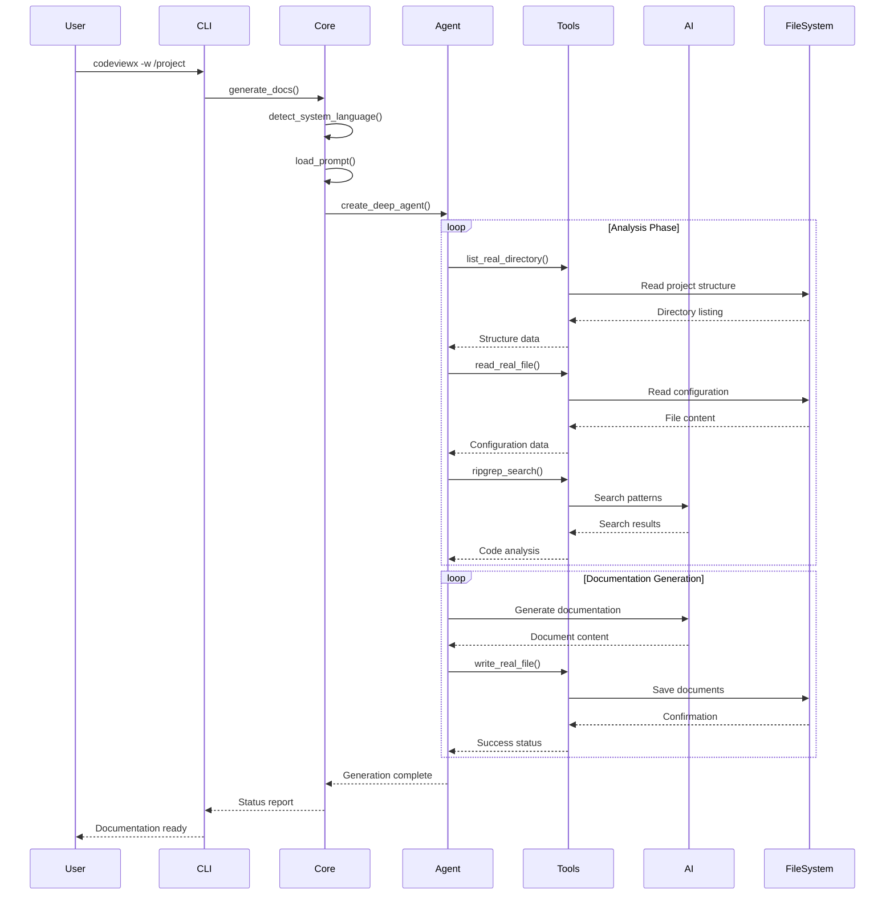

### Web Server Flow

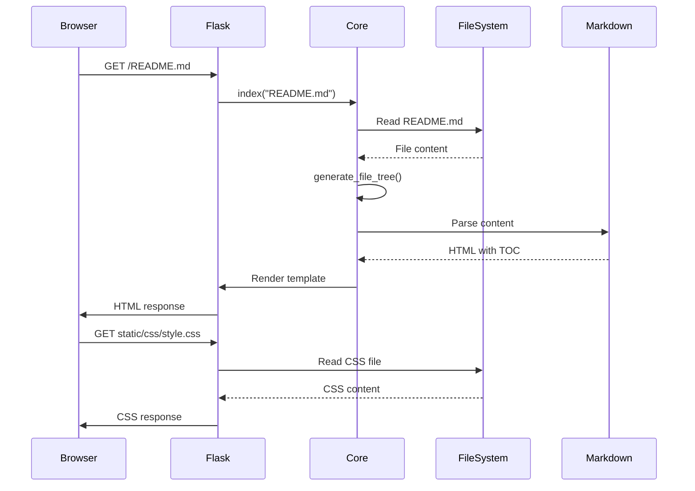

## Component Interaction Patterns

### 1. Agent-Tool Pattern

The AI agent uses a tool-based architecture to interact with the system:

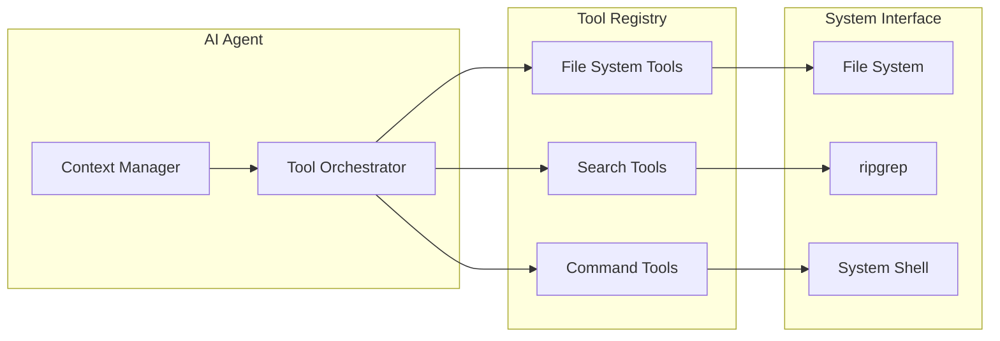

### 2. Plugin Architecture

The system supports extensible tool registration:

```python
# File: codeviewx/tools/__init__.py | Line: 6-16 | Description: Tool exports
from .command import execute_command
from .search import ripgrep_search
from .filesystem import write_real_file, read_real_file, list_real_directory

__all__ = [
    # 命令执行工具
    'execute_command',
    
    # 搜索工具
    'ripgrep_search',
    
    # 文件系统工具
    'write_real_file',
    'read_real_file',
    'list_real_directory',
]
```

### 3. Configuration-Driven Behavior

The system behavior is controlled through multiple configuration layers:

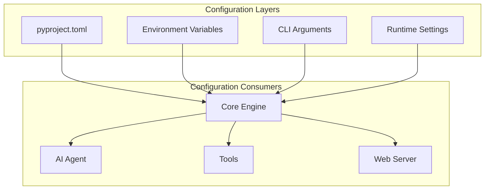

## Security Architecture

### 1. API Key Management

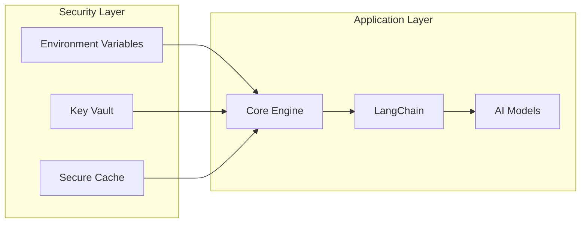

### 2. File System Access Control

- **Sandboxing**: Limited to specified working directory
- **Path Validation**: Prevents directory traversal attacks
- **Permission Checks**: Validates read/write permissions
- **File Type Restrictions**: Limits file access to safe types

### 3. Command Execution Security

- **Command Whitelisting**: Only allows approved commands
- **Argument Sanitization**: Prevents command injection
- **Resource Limits**: Constrains execution time and memory

## Performance Architecture

### 1. Caching Strategy

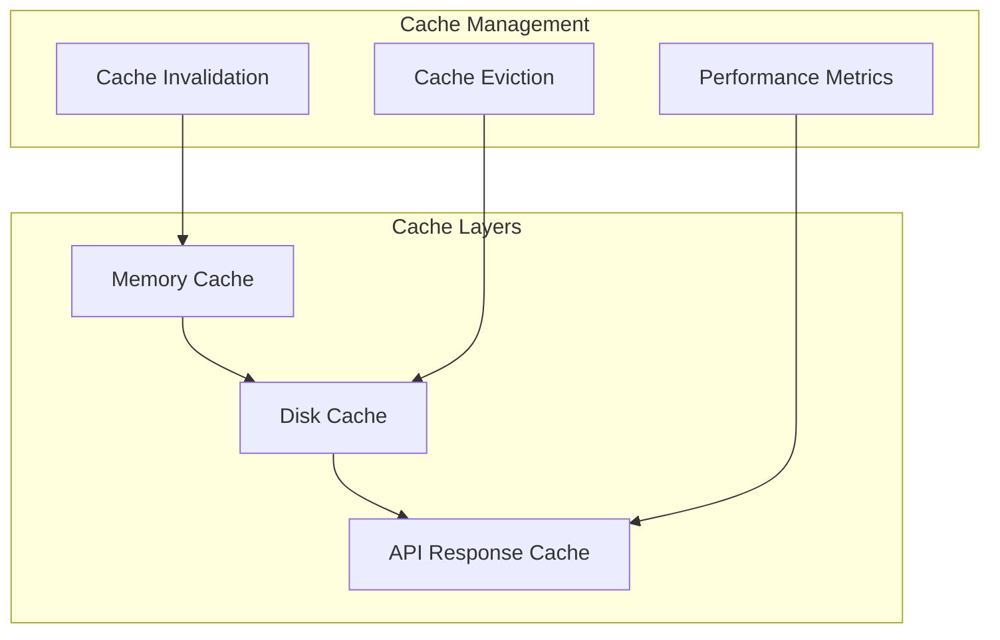

### 2. Parallel Processing

- **Tool Parallelization**: Multiple tools can run simultaneously
- **File Processing**: Parallel analysis of multiple files
- **API Batching**: Batch processing for AI requests

### 3. Resource Management

- **Memory Limits**: Configurable memory constraints
- **Rate Limiting**: API call throttling
- **Timeout Management**: Operation timeouts

## Scalability Architecture

### 1. Horizontal Scaling

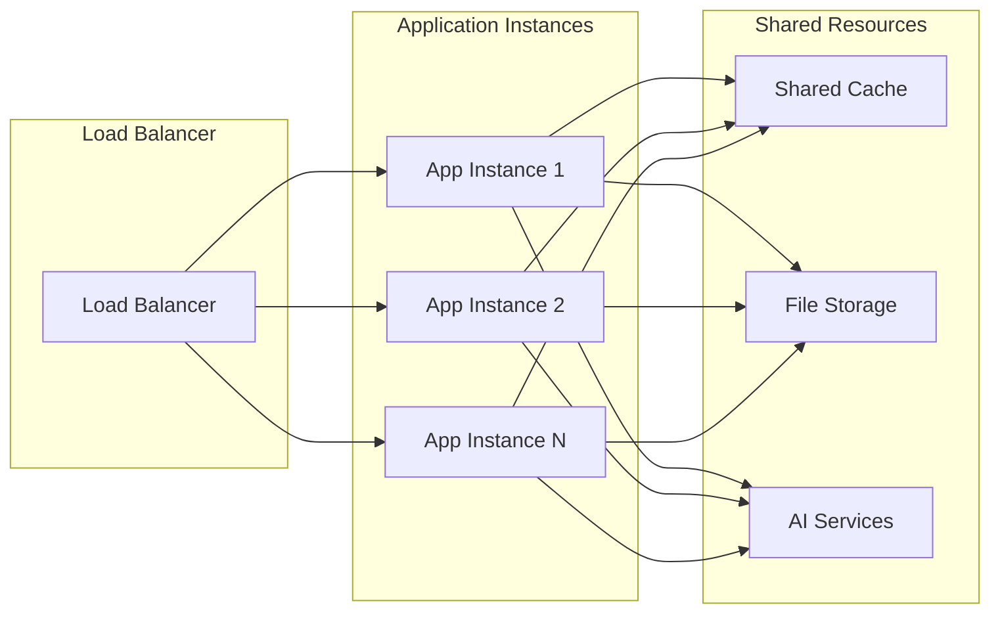

### 2. Vertical Scaling

- **Resource Allocation**: Dynamic resource assignment
- **Performance Monitoring**: Real-time performance tracking
- **Auto-scaling**: Automatic capacity adjustment

## Deployment Architecture

### 1. Development Environment

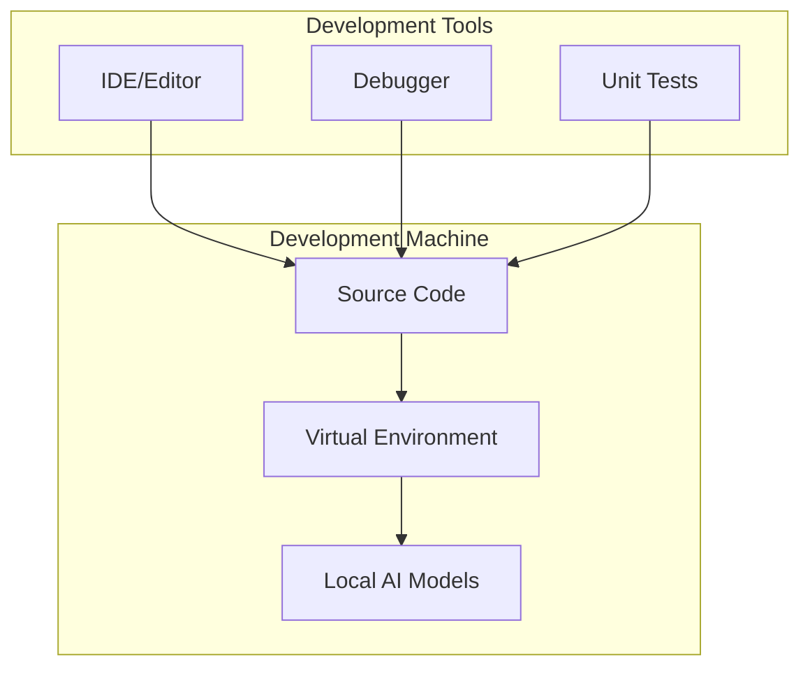

### 2. Production Environment

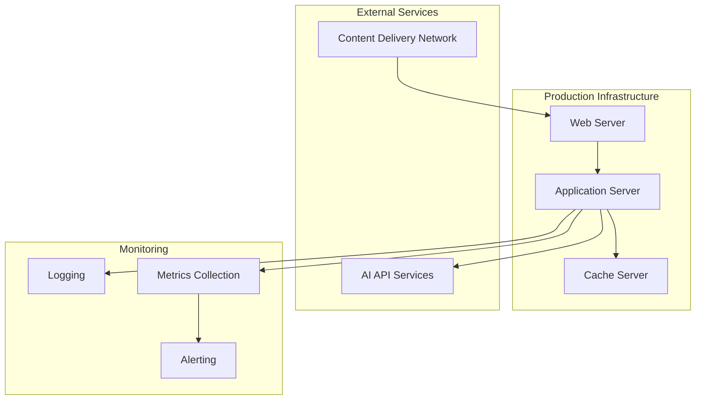

## Integration Architecture

### 1. AI Model Integration

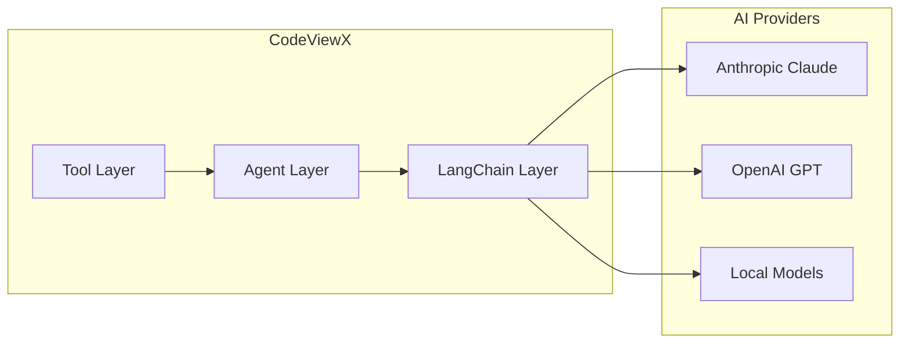

### 2. Tool Integration

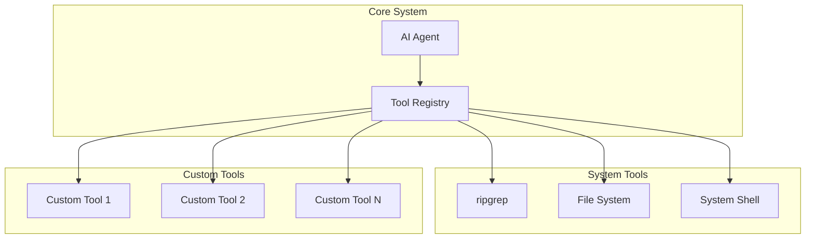

## Architecture Decisions and Trade-offs

### 1. Technology Choices

| Decision | Reason | Trade-off |
|----------|--------|-----------|
| **Python 3.8+** | Rich ecosystem, AI framework support | Performance vs. development speed |
| **DeepAgents** | Specialized for AI agents | Dependency on external framework |
| **Flask** | Lightweight, flexible | Limited built-in features |
| **ripgrep** | Superior performance | System dependency required |

### 2. Design Patterns

| Pattern | Benefit | Implementation Cost |
|---------|---------|-------------------|
| **Tool-based Architecture** | Flexibility, extensibility | Increased complexity |
| **Plugin System** | Easy customization | Plugin management overhead |
| **Configuration-driven** | Runtime flexibility | Configuration complexity |

### 3. Performance Considerations

| Aspect | Approach | Impact |
|--------|----------|---------|
| **Caching** | Multi-level caching | Improved response times |
| **Parallel Processing** | Concurrent tool execution | Better resource utilization |
| **Streaming** | Real-time progress updates | Enhanced user experience |

---

*This architecture documentation provides a comprehensive view of the CodeViewX system design. For implementation details, see the [Core Mechanisms](04-core-mechanisms.md) documentation.*