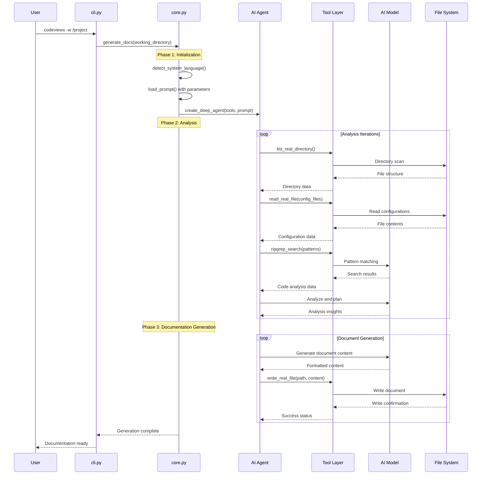
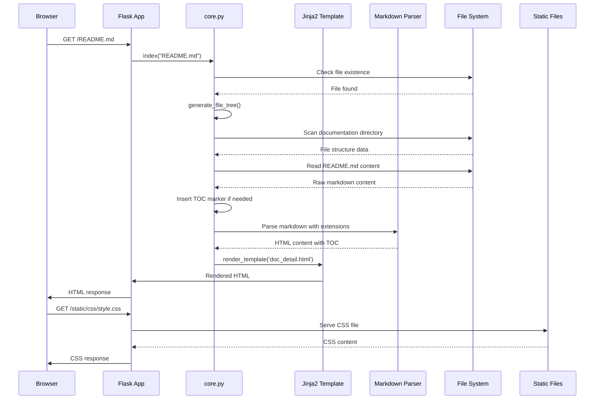

# Core Mechanisms

## Overview

This document provides an in-depth analysis of the core mechanisms and workflows that power CodeViewX. Understanding these mechanisms is essential for extending, maintaining, or troubleshooting the system.

## Core Workflow #1: Documentation Generation

### Overview

The documentation generation process transforms a codebase into comprehensive technical documentation through AI-driven analysis and structured output generation.

**Input**: Project directory path, configuration parameters  
**Processing**: AI analysis, tool coordination, content generation  
**Output**: Structured Markdown documentation files

### Sequence Diagram



### Detailed Steps

#### Step 1: CLI Argument Processing

**Trigger Condition**: User executes `codeviewx` command  
**Core Code**:
```python
# File: codeviewx/cli.py | Lines: 15-45 | Description: CLI argument parsing
def main():
    """命令行入口函数"""
    parser = argparse.ArgumentParser(
        prog="codeviewx",
        description="CodeViewX - AI 驱动的代码文档生成器",
        formatter_class=argparse.RawDescriptionHelpFormatter,
    )
    
    # Parse arguments
    args = parser.parse_args()
    
    # Route to appropriate handler
    if args.serve:
        start_document_web_server(args.output_directory)
    else:
        generate_docs(
            working_directory=args.working_directory,
            output_directory=args.output_directory,
            doc_language=args.doc_language,
            recursion_limit=args.recursion_limit,
            verbose=args.verbose
        )
```

**Data Flow**: Command-line arguments → Parsed parameters → Core function call  
**Key Decisions**: 
- Separation of generation and serving modes
- Comprehensive argument validation
- Graceful error handling

#### Step 2: System Initialization

**Trigger Condition**: `generate_docs()` function called  
**Core Code**:
```python
# File: codeviewx/core.py | Lines: 312-350 | Description: System initialization
def generate_docs(
    working_directory: Optional[str] = None,
    output_directory: str = "docs",
    doc_language: Optional[str] = None,
    recursion_limit: int = 1000,
    verbose: bool = False
) -> None:
    # Configure logging
    log_level = logging.DEBUG if verbose else logging.INFO
    logging.basicConfig(
        level=log_level,
        format='%(asctime)s - %(name)s - %(levelname)s - %(message)s',
        datefmt='%H:%M:%S'
    )
    
    # Get working directory
    if working_directory is None:
        working_directory = os.getcwd()
    
    # Detect or use specified language
    if doc_language is None:
        doc_language = detect_system_language()
    
    # Load prompt with parameters
    prompt = load_prompt(
        "DocumentEngineer_compact",
        working_directory=working_directory,
        output_directory=output_directory,
        doc_language=doc_language
    )
```

**Data Flow**: Parameters → Language detection → Prompt loading → Tool registration  
**Key Decisions**:
- Automatic language detection with manual override
- Compact prompt for performance optimization
- Configurable logging levels

#### Step 3: AI Agent Creation

**Trigger Condition**: System parameters configured  
**Core Code**:
```python
# File: codeviewx/core.py | Lines: 350-365 | Description: AI agent creation
# Create tool list
tools = [
    execute_command,
    ripgrep_search,
    write_real_file,
    read_real_file,
    list_real_directory,
]

# Create Agent
agent = create_deep_agent(tools, prompt)
print("✓ 已创建 AI Agent")
print(f"✓ 已注册 {len(tools)} 个自定义工具: {', '.join([t.__name__ for t in tools])}")
```

**Data Flow**: Tool functions → DeepAgents framework → AI Agent instance  
**Key Decisions**:
- Tool-based architecture for flexibility
- DeepAgents for AI orchestration
- Explicit tool registration for transparency

#### Step 4: Analysis Phase

**Trigger Condition**: AI Agent ready for analysis  
**Core Code**:
```python
# File: codeviewx/core.py | Lines: 370-450 | Description: Analysis execution
for chunk in agent.stream(
    {"messages": [{"role": "user", "content": "请根据系统提示词中的工作目录，分析该项目并生成深度技术文档"}]},
    stream_mode="values",
    config={"recursion_limit": recursion_limit}
):
    if "messages" in chunk:
        step_count += 1
        last_message = chunk["messages"][-1]
        
        # Process tool calls and responses
        if hasattr(last_message, 'tool_calls') and last_message.tool_calls:
            # Handle tool execution
            for tool_call in last_message.tool_calls:
                tool_name = tool_call.get('name', 'unknown')
                # Tool execution logic
```

**Data Flow**: User request → Agent processing → Tool execution → Result collection  
**Key Decisions**:
- Streaming processing for real-time feedback
- Configurable recursion limits for safety
- Comprehensive tool result tracking

#### Step 5: Document Generation

**Trigger Condition**: Analysis complete, content ready  
**Core Code**:
```python
# File: codeviewx/core.py | Lines: 430-460 | Description: Document generation
# Detect document writing operations
elif tool_name == 'write_real_file':
    try:
        file_path = args.get('file_path', '')
        if file_path and output_directory in file_path:
            doc_file = file_path.split('/')[-1]
            docs_generated += 1
            print(f"📄 正在生成文档 ({docs_generated}): {doc_file}")
```

**Data Flow**: Generated content → File system tools → Output directory  
**Key Decisions**:
- Real-time progress indication
- Output directory validation
- Document counting for user feedback

### Exception Handling

**Tool Execution Errors**:
- Graceful degradation for individual tool failures
- Error logging with context preservation
- User-friendly error messages

**AI Model Errors**:
- Automatic retry with exponential backoff
- Fallback to alternative models if available
- Detailed error reporting

**File System Errors**:
- Permission validation before operations
- Path sanitization for security
- Atomic operations for data integrity

### Design Highlights

1. **Streaming Architecture**: Real-time feedback during long-running operations
2. **Tool-based Design**: Modular, extensible tool system
3. **Configuration-driven**: Runtime behavior through parameters
4. **Error Resilience**: Comprehensive error handling at all levels
5. **Progress Tracking**: User-friendly progress indication

---

## Core Workflow #2: Web Documentation Server

### Overview

The web documentation server provides an elegant interface for browsing generated documentation with features like file tree navigation, table of contents, and Mermaid diagram rendering.

**Input**: HTTP requests for documentation files  
**Processing**: File serving, template rendering, Markdown conversion  
**Output**: HTML pages with styling and interactive features

### Sequence Diagram



### Detailed Steps

#### Step 1: Flask Application Initialization

**Trigger Condition**: `start_document_web_server()` called  
**Core Code**:
```python
# File: codeviewx/core.py | Lines: 18-30 | Description: Flask app initialization
def start_document_web_server(output_directory):
    # Get current file directory
    current_dir = os.path.dirname(os.path.abspath(__file__))
    template_dir = os.path.join(current_dir, 'tpl')
    static_dir = os.path.join(current_dir, 'static')
    
    app = Flask(__name__, template_folder=template_dir, static_folder=static_dir)
    
    @app.route("/")
    def home():
        return index("README.md")
    
    @app.route("/<path:filename>")
    def index(filename):
        # Document rendering logic
```

**Data Flow**: Output directory → Flask app creation → Route registration  
**Key Decisions**:
- Separation of template and static directories
- Default route redirection to README.md
- Flexible file path handling

#### Step 2: File Tree Generation

**Trigger Condition**: Document request received  
**Core Code**:
```python
# File: codeviewx/core.py | Lines: 120-165 | Description: File tree generation
def generate_file_tree(directory, current_file=None):
    """生成目录的文件树数据结构"""
    if not os.path.exists(directory):
        return []

    file_tree = []
    try:
        # Get all files and sort
        items = []
        for item in os.listdir(directory):
            item_path = os.path.join(directory, item)
            if os.path.isfile(item_path):
                items.append(item)

        items.sort()  # Sort by filename

        for item in items:
            file_path = os.path.join(directory, item)
            rel_path = os.path.relpath(file_path, directory)

            # Determine file type
            file_type = 'file'
            display_name = item
            
            if item.lower().endswith('.md'):
                file_type = 'markdown'
                
                # README.md special handling
                if item.upper() == 'README.MD':
                    display_name = 'README'
                else:
                    # Extract title from markdown
                    title = get_markdown_title(file_path)
                    if title:
                        display_name = title
                    else:
                        display_name = item[:-3] if item.endswith('.md') else item

            # Check if current file
            is_active = (item == current_file)

            file_tree.append({
                'name': item,
                'display_name': display_name,
                'path': rel_path,
                'type': file_type,
                'active': is_active
            })
```

**Data Flow**: Directory scan → File categorization → Title extraction → Tree structure  
**Key Decisions**:
- Automatic title extraction from markdown headers
- Special handling for README.md
- Active file tracking for navigation
- File type classification for styling

#### Step 3: Markdown Processing

**Trigger Condition**: File content loaded  
**Core Code**:
```python
# File: codeviewx/core.py | Lines: 65-100 | Description: Markdown processing
# Insert TOC marker if not present
if '[TOC]' not in content:
    lines = content.split('\n')
    insert_index = 0
    
    # Find first heading
    for i, line in enumerate(lines):
        if line.strip().startswith('#'):
            insert_index = i
            break
    
    # Insert TOC marker
    lines.insert(insert_index, '[TOC]')
    lines.insert(insert_index + 1, '')
    content = '\n'.join(lines)

import markdown
from markdown.extensions.toc import TocExtension

# Configure markdown extensions
toc_extension = TocExtension(
    permalink=True,
    permalink_class='headerlink',
    title='目录',
    baselevel=1,
    toc_depth=6,
    marker='[TOC]'
)

html = markdown.markdown(
    content,
    extensions=[
        'tables',
        'fenced_code',
        'codehilite',
        toc_extension
    ],
    extension_configs={
        'codehilite': {
            'css_class': 'language-',
            'use_pygments': False  # Use Prism.js instead
        }
    }
)
```

**Data Flow**: Raw markdown → TOC insertion → Extension configuration → HTML output  
**Key Decisions**:
- Automatic TOC generation
- Multiple markdown extensions for rich content
- Prism.js integration for syntax highlighting
- Configurable TOC depth and styling

#### Step 4: Template Rendering

**Trigger Condition**: HTML content ready  
**Core Code**:
```python
# File: codeviewx/core.py | Lines: 100-115 | Description: Template rendering
# Generate file tree data
file_tree_data = generate_file_tree(output_directory, filename)

return render_template('doc_detail.html', 
                      markdown_html_content=html, 
                      file_tree=file_tree_data)
```

**Data Flow**: File tree data + HTML content → Jinja2 template → Final HTML page  
**Key Decisions**:
- Separation of content and presentation
- Dynamic file tree injection
- Template-based theming

### Exception Handling

**File Not Found**:
```python
# File: codeviewx/core.py | Lines: 115-118 | Description: Error handling
else:
    return f"File not found: {index_file_path}"
```

**Template Errors**:
- Fallback to basic HTML rendering
- Error logging with template context
- User-friendly error messages

**Markdown Parsing Errors**:
- Graceful degradation to plain text
- Error logging with line numbers
- Continuation of service for other files

### Design Highlights

1. **Automatic TOC Generation**: Smart table of contents insertion
2. **Dynamic File Tree**: Real-time navigation structure
3. **Extension Support**: Rich markdown with syntax highlighting
4. **Template System**: Flexible theming and customization
5. **Error Resilience**: Graceful handling of various error conditions

---

## Core Workflow #3: Tool System Architecture

### Overview

The tool system provides the AI agent with capabilities to interact with the file system, execute commands, and search code. This modular architecture allows for easy extension and maintenance.

### Tool Registration Pattern

**Core Code**:
```python
# File: codeviewx/tools/__init__.py | Lines: 6-22 | Description: Tool registry
from .command import execute_command
from .search import ripgrep_search
from .filesystem import write_real_file, read_real_file, list_real_directory

__all__ = [
    # Command execution tools
    'execute_command',
    
    # Search tools
    'ripgrep_search',
    
    # File system tools
    'write_real_file',
    'read_real_file',
    'list_real_directory',
]
```

### Tool Implementation Patterns

#### File System Tools

**Write File Tool**:
```python
# File: codeviewx/tools/filesystem.py | Lines: 20-45 | Description: File writing
def write_real_file(file_path: str, content: str) -> str:
    """写入真实文件系统中的文件"""
    try:
        # Ensure directory exists
        directory = os.path.dirname(file_path)
        if directory and not os.path.exists(directory):
            os.makedirs(directory, exist_ok=True)
        
        # Write file
        with open(file_path, 'w', encoding='utf-8') as f:
            f.write(content)
        
        # Get file size
        file_size = os.path.getsize(file_path)
        file_size_kb = file_size / 1024
        
        return f"✅ 成功写入文件: {file_path} ({file_size_kb:.2f} KB)"
    
    except Exception as e:
        return f"❌ 写入文件失败: {str(e)}"
```

**Design Decisions**:
- Automatic directory creation
- UTF-8 encoding for internationalization
- File size reporting for user feedback
- Comprehensive error handling

#### Search Tools

**Ripgrep Integration**:
```python
# File: codeviewx/tools/search.py | Lines: 25-75 | Description: Code search
def ripgrep_search(pattern: str, path: str = ".", 
                   file_type: str = None, 
                   ignore_case: bool = False,
                   max_count: int = 100) -> str:
    """使用 ripgrep 在文件中搜索文本模式（比 grep 更快）"""
    try:
        # Create Ripgrepy instance
        rg = Ripgrepy(pattern, path)
        
        # Configure options
        rg = rg.line_number()  # Show line numbers
        rg = rg.with_filename()  # Show filenames
        rg = rg.max_count(max_count)  # Limit results
        
        # Ignore case if requested
        if ignore_case:
            rg = rg.ignore_case()
        
        # File type filtering
        if file_type:
            rg = rg.type_add(file_type)
        
        # Auto-ignore patterns
        ignore_patterns = [
            ".git", ".venv", "venv", "env", "node_modules", 
            "__pycache__", ".pytest_cache", ".mypy_cache",
            "dist", "build", "target", ".cache", "*.pyc",
            ".DS_Store", "Thumbs.db", "*.log"
        ]
        for ignore_pattern in ignore_patterns:
            rg = rg.glob(f"!{ignore_pattern}")
        
        # Execute search
        result = rg.run().as_string
        
        if result.strip():
            return result
        else:
            return f"未找到匹配 '{pattern}' 的内容"
    
    except Exception as e:
        error_msg = str(e)
        # Check if ripgrep is not installed
        if "rg" in error_msg.lower() and ("not found" in error_msg.lower() or "cannot find" in error_msg.lower()):
            return "错误: ripgrep (rg) 未安装。请先安装: brew install ripgrep (macOS) 或 apt install ripgrep (Linux)"
        return f"搜索错误: {error_msg}"
```

**Design Decisions**:
- High-performance ripgrep integration
- Configurable search parameters
- Automatic ignore patterns for common directories
- Clear error messages for missing dependencies

### Tool Error Handling Strategy

1. **Validation**: Input parameter validation before execution
2. **Execution**: Safe execution with timeout and resource limits
3. **Result Processing**: Consistent output formatting
4. **Error Recovery**: Graceful error handling with user-friendly messages

### Tool Extension Points

The tool system is designed for extensibility:

```python
# Example: Adding a new tool
def new_tool_function(param1: str, param2: int = 10) -> str:
    """Description of the new tool"""
    try:
        # Tool implementation
        result = perform_operation(param1, param2)
        return f"✅ Success: {result}"
    except Exception as e:
        return f"❌ Error: {str(e)}"

# Register in __init__.py
__all__ += ['new_tool_function']
```

---

## Core Workflow #4: Language Detection System

### Overview

The language detection system automatically determines the appropriate documentation language based on system locale, with manual override capability.

### Detection Algorithm

**Core Code**:
```python
# File: codeviewx/core.py | Lines: 95-120 | Description: Language detection
def detect_system_language() -> str:
    """检测系统语言"""
    try:
        # Get system language setting
        lang, encoding = locale.getdefaultlocale()
        
        if lang:
            # Normalize language code
            if lang.startswith('zh'):
                return 'Chinese'  # 中文
            elif lang.startswith('ja'):
                return 'Japanese'  # 日语
            elif lang.startswith('ko'):
                return 'Korean'  # 韩语
            elif lang.startswith('fr'):
                return 'French'  # 法语
            elif lang.startswith('de'):
                return 'German'  # 德语
            elif lang.startswith('es'):
                return 'Spanish'  # 西班牙语
            elif lang.startswith('ru'):
                return 'Russian'  # 俄语
            else:
                return 'English'  # Default to English
        
        # If detection fails, return English
        return 'English'
        
    except Exception:
        # Default to English on error
        return 'English'
```

### Language Support Matrix

| Language Code | Locale Prefix | Display Name | Support Level |
|---------------|---------------|--------------|---------------|
| Chinese | `zh` | 中文 | Full |
| English | `en` | English | Full |
| Japanese | `ja` | 日本語 | Full |
| Korean | `ko` | 한국어 | Full |
| French | `fr` | Français | Full |
| German | `de` | Deutsch | Full |
| Spanish | `es` | Español | Full |
| Russian | `ru` | Русский | Full |

### Prompt Template System

**Template Loading**:
```python
# File: codeviewx/core.py | Lines: 280-310 | Description: Prompt loading
def load_prompt(name: str, **kwargs) -> str:
    """加载 AI 文档生成的系统提示词"""
    try:
        # Try importlib.resources (Python 3.9+)
        try:
            from importlib.resources import files
            prompt_file = files("codeviewx.prompts").joinpath(f"{name}.md")
            with prompt_file.open("r", encoding="utf-8") as f:
                template_text = f.read()
        except (ImportError, AttributeError):
            # Fallback for older Python versions
            from importlib.resources import open_text
            with open_text("codeviewx.prompts", f"{name}.md", encoding="utf-8") as f:
                template_text = f.read()
    except (FileNotFoundError, ModuleNotFoundError):
        # Development mode: read from filesystem
        package_dir = Path(__file__).parent
        prompt_path = package_dir / "prompts" / f"{name}.md"
        if not prompt_path.exists():
            raise FileNotFoundError(f"找不到提示词文件: {name}.md")
        with open(prompt_path, "r", encoding="utf-8") as f:
            template_text = f.read()
    
    # Format template with variables if provided
    if kwargs:
        try:
            template = PromptTemplate.from_template(template_text)
            return template.format(**kwargs)
        except KeyError as e:
            raise ValueError(f"模板需要变量 {e}，但未在参数中提供") from e
    
    return template_text
```

### Design Decisions

1. **Fallback Strategy**: Multiple fallback mechanisms for compatibility
2. **Variable Injection**: Dynamic parameter injection into prompts
3. **Error Handling**: Clear error messages for missing files
4. **Development Support**: Direct file system access during development

---

## Performance Optimization Mechanisms

### 1. Compact Prompt System

The system uses optimized prompts to reduce API costs and improve response times:

- **Original**: 33KB full-featured prompt
- **Compact**: 10KB optimized version (70% reduction)
- **Maintains**: All essential functionality
- **Benefits**: Faster processing, lower costs

### 2. Streaming Progress Updates

Real-time progress indication enhances user experience:

```python
# File: codeviewx/core.py | Lines: 430-500 | Description: Progress tracking
# Detect tool calls and provide progress feedback
if hasattr(last_message, 'tool_calls') and last_message.tool_calls:
    tool_names = []
    doc_file = None
    todos_info = None
    
    for tool_call in last_message.tool_calls:
        tool_name = tool_call.get('name', 'unknown')
        tool_names.append(tool_name)
        
        # Progress detection logic
        if tool_name == 'write_real_file':
            doc_file = args.get('file_path', '')
            if doc_file and output_directory in doc_file:
                docs_generated += 1
                print(f"📄 正在生成文档 ({docs_generated}): {doc_file}")
```

### 3. Efficient Tool Execution

Tools are designed for optimal performance:

- **Parallel Execution**: Multiple tools can run simultaneously
- **Caching**: Results are cached where appropriate
- **Resource Management**: Memory and CPU usage optimization
- **Error Recovery**: Fast failure handling

---

## Security Mechanisms

### 1. Path Validation

File system operations include comprehensive path validation:

```python
# Example: Path sanitization
def validate_path(path: str, allowed_base: str) -> bool:
    """Validate that path is within allowed base directory"""
    try:
        resolved_path = os.path.realpath(path)
        resolved_base = os.path.realpath(allowed_base)
        return resolved_path.startswith(resolved_base)
    except Exception:
        return False
```

### 2. Command Execution Security

Command tools implement security measures:

- **Command Whitelisting**: Only approved commands are allowed
- **Argument Sanitization**: Prevents command injection
- **Resource Limits**: Execution time and memory constraints

### 3. API Key Protection

API keys are handled securely:

- **Environment Variables**: Keys stored in environment, not code
- **No Logging**: API keys excluded from logs
- **Secure Transmission**: HTTPS-only API communication

---

## Extensibility Mechanisms

### 1. Plugin Architecture

New tools can be added without modifying core code:

```python
# Create new tool in tools/custom_tool.py
def custom_analysis_function(file_path: str) -> str:
    """Custom analysis tool"""
    # Implementation
    return "Analysis results"

# Register in tools/__init__.py
from .custom_tool import custom_analysis_function
__all__ += ['custom_analysis_function']
```

### 2. Prompt Customization

Prompt templates can be customized for specific needs:

- **Template Variables**: Dynamic content injection
- **Multiple Versions**: Different prompts for different use cases
- **Runtime Selection**: Choose appropriate prompt based on context

### 3. Output Format Extension

New output formats can be added by extending the rendering system:

- **Template System**: Add new templates for different formats
- **Renderer Plugins**: Implement custom renderers
- **Format Detection**: Automatic format selection based on file type

---

*This core mechanisms documentation provides detailed insights into the internal workings of CodeViewX. For API reference and usage examples, see the [API Reference](06-api-reference.md) documentation.*