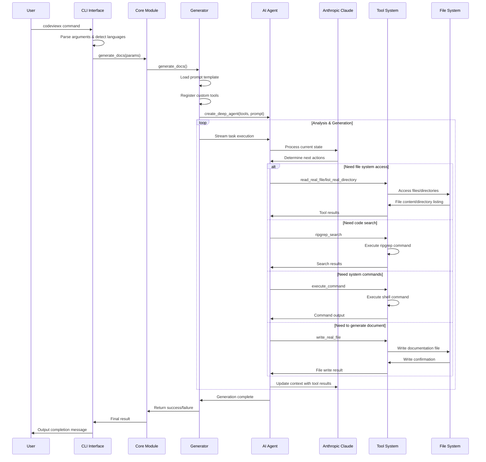
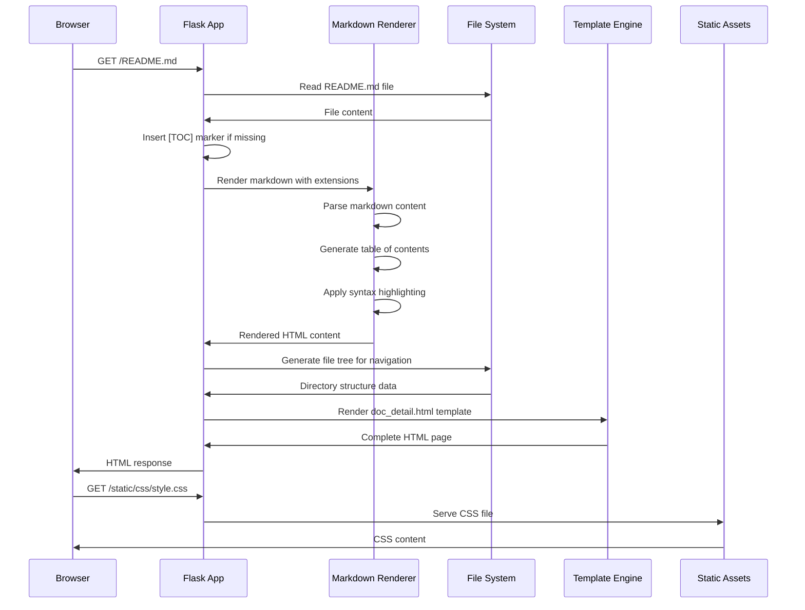

# Core Working Mechanisms

## Overview

This document provides an in-depth analysis of CodeViewX's core working mechanisms, including the AI-driven documentation generation workflow, tool system architecture, and key implementation details.

## Core Flow #1: Documentation Generation Workflow

### Overview
The documentation generation process transforms a codebase into comprehensive technical documentation through AI analysis, file processing, and structured output generation.

**Input**: Project directory path and configuration parameters  
**Processing**: AI-powered code analysis and document generation  
**Output**: Complete technical documentation set in Markdown format

### Sequence Diagram



### Detailed Steps

#### Step 1: CLI Initialization and Configuration

**Trigger Condition**: User executes `codeviewx` command

**Core Code**:
```python
# File: codeviewx/cli.py | Lines: 16-40 | Description: CLI main function initialization
def main():
    ui_lang = detect_ui_language()
    get_i18n().set_locale(ui_lang)
    
    parser = argparse.ArgumentParser(
        prog="codeviewx",
        description=t('cli_description'),
        formatter_class=argparse.RawDescriptionHelpFormatter,
        epilog=t('cli_examples')
    )
```

**Data Flow**: Command line arguments → Argument parser → Configuration object  
**Key Points**: 
- Auto-detects UI language based on system locale
- Supports both documentation language and UI language settings
- Comprehensive argument validation and help system

#### Step 2: Generator Initialization

**Trigger Condition**: CLI passes control to core generator

**Core Code**:
```python
# File: codeviewx/generator.py | Lines: 24-65 | Description: Generator setup and configuration
def generate_docs(
    working_directory: Optional[str] = None,
    output_directory: str = "docs",
    doc_language: Optional[str] = None,
    ui_language: Optional[str] = None,
    recursion_limit: int = 1000,
    verbose: bool = False
) -> None:
    # Auto-detect languages if not specified
    if ui_language is None:
        ui_language = detect_ui_language()
    if doc_language is None:
        doc_language = detect_system_language()
    
    # Setup logging based on verbose flag
    log_level = logging.DEBUG if verbose else logging.INFO
```

**Data Flow**: Configuration parameters → Language detection → Logging setup  
**Key Points**:
- Graceful fallback to auto-detection when languages not specified
- Configurable logging levels for debugging vs production use
- Input validation and sanitization

#### Step 3: AI Agent Creation and Tool Registration

**Trigger Condition**: Generator creates AI processing engine

**Core Code**:
```python
# File: codeviewx/generator.py | Lines: 66-85 | Description: AI agent creation
prompt = load_prompt(
    "document_engineer",
    working_directory=working_directory,
    output_directory=output_directory,
    doc_language=doc_language
)

tools = [
    execute_command,
    ripgrep_search,
    write_real_file,
    read_real_file,
    list_real_directory,
]

agent = create_deep_agent(tools, prompt)
```

**Data Flow**: Prompt template → Tool registration → DeepAgents agent creation  
**Key Points**:
- Prompt template loaded with project-specific context
- Custom tools provide AI agent with file system and search capabilities
- DeepAgents framework handles agent orchestration

#### Step 4: AI Agent Execution Loop

**Trigger Condition**: Agent starts processing documentation task

**Core Code**:
```python
# File: codeviewx/generator.py | Lines: 88-130 | Description: Agent execution streaming
for chunk in agent.stream(
    {"messages": [{"role": "user", "content": t('agent_task_instruction')}]},
    stream_mode="values",
    config={"recursion_limit": recursion_limit}
):
    if "messages" in chunk:
        step_count += 1
        last_message = chunk["messages"][-1]
        
        # Process tool calls and update progress
        if hasattr(last_message, 'tool_calls') and last_message.tool_calls:
            # Handle tool execution and progress tracking
```

**Data Flow**: Task instruction → AI reasoning → Tool execution → Context update → Repeat  
**Key Points**:
- Streaming execution allows real-time progress tracking
- Recursion limit prevents infinite loops
- Comprehensive error handling and progress reporting

#### Step 5: Document Generation Sequence

**Trigger Condition**: AI agent decides to generate documentation files

**Core Code**:
```python
# File: codeviewx/tools/filesystem.py | Lines: 8-40 | Description: File writing mechanism
def write_real_file(file_path: str, content: str) -> str:
    try:
        directory = os.path.dirname(file_path)
        if directory and not os.path.exists(directory):
            os.makedirs(directory, exist_ok=True)
        
        with open(file_path, 'w', encoding='utf-8') as f:
            f.write(content)
        
        file_size = os.path.getsize(file_path)
        file_size_kb = file_size / 1024
        
        return f"✅ Successfully wrote file: {file_path} ({file_size_kb:.2f} KB)"
```

**Data Flow**: Document content → File system write → Size calculation → Confirmation  
**Key Points**:
- Automatic directory creation for nested paths
- UTF-8 encoding for international content support
- File size tracking for progress reporting

### Exception Handling

- **API Key Errors**: Graceful fallback with user guidance
- **File System Errors**: Permission handling and path validation
- **Network Timeouts**: Retry logic with exponential backoff
- **AI Agent Errors**: Context preservation and recovery attempts

### Design Highlights

1. **Streaming Architecture**: Real-time progress feedback during long-running operations
2. **Tool-Based Design**: Modular tool system allows extensible AI capabilities
3. **Multi-Language Support**: Complete internationalization throughout the stack
4. **Robust Error Handling**: Comprehensive error recovery and user guidance

## Core Flow #2: Web Server Documentation Browsing

### Overview
The web server provides an interactive interface for browsing generated documentation with enhanced features like table of contents, file trees, and Mermaid diagram support.

**Input**: HTTP requests for documentation files  
**Processing**: Markdown rendering, template filling, and static asset serving  
**Output**: HTML pages with enhanced documentation display

### Sequence Diagram



### Detailed Steps

#### Step 1: Flask Application Initialization

**Trigger Condition**: User starts documentation server

**Core Code**:
```python
# File: codeviewx/server.py | Lines: 105-115 | Description: Flask server setup
def start_document_web_server(output_directory):
    current_dir = os.path.dirname(os.path.abspath(__file__))
    template_dir = os.path.join(current_dir, 'tpl')
    static_dir = os.path.join(current_dir, 'static')
    
    app = Flask(__name__, template_folder=template_dir, static_folder=static_dir)
```

**Data Flow**: Output directory path → Template/static directory resolution → Flask app creation  
**Key Points**:
- Automatic template and static asset path resolution
- Isolated Flask application for documentation serving
- Debug mode enabled for development

#### Step 2: Request Routing and File Processing

**Trigger Condition**: Browser requests documentation file

**Core Code**:
```python
# File: codeviewx/server.py | Lines: 118-160 | Description: Route handling and markdown processing
@app.route("/<path:filename>")
def index(filename):
    if not filename or filename == "":
        filename = "README.md"
    
    index_file_path = os.path.join(output_directory, filename)
    if os.path.exists(index_file_path):
        with open(index_file_path, "r") as f:
            content = f.read()
        
        # Auto-insert TOC if missing
        if '[TOC]' not in content:
            lines = content.split('\n')
            insert_index = 0
            for i, line in enumerate(lines):
                if line.strip().startswith('#'):
                    insert_index = i
                    break
            lines.insert(insert_index, '[TOC]')
            lines.insert(insert_index + 1, '')
            content = '\n'.join(lines)
```

**Data Flow**: URL path → File path resolution → Content reading → TOC insertion → Markdown rendering  
**Key Points**:
- Automatic table of contents generation
- Graceful handling of missing files
- Default to README.md for root requests

#### Step 3: Markdown Rendering with Extensions

**Trigger Condition**: File content ready for display

**Core Code**:
```python
# File: codeviewx/server.py | Lines: 162-185 | Description: Advanced markdown processing
import markdown
from markdown.extensions.toc import TocExtension

toc_extension = TocExtension(
    permalink=True,
    permalink_class='headerlink',
    title=t('server_toc_title'),
    baselevel=1,
    toc_depth=6,
    marker='[TOC]'
)

html = markdown.markdown(
    content,
    extensions=[
        'tables',
        'fenced_code',
        'codehilite',
        toc_extension
    ],
    extension_configs={
        'codehilite': {
            'css_class': 'language-',
            'use_pygments': False
        }
    }
)
```

**Data Flow**: Raw markdown → Extension processing → HTML generation  
**Key Points**:
- Table of contents with permalinks
- Code syntax highlighting
- Table and fenced code block support
- Custom CSS class configuration

#### Step 4: File Tree Generation

**Trigger Condition**: Navigation sidebar needs updating

**Core Code**:
```python
# File: codeviewx/server.py | Lines: 33-80 | Description: File tree generation
def generate_file_tree(directory, current_file=None):
    if not os.path.exists(directory):
        return []
    
    file_tree = []
    try:
        items = []
        for item in os.listdir(directory):
            item_path = os.path.join(directory, item)
            if os.path.isfile(item_path):
                items.append(item)
        
        items.sort()
        
        for item in items:
            file_path = os.path.join(directory, item)
            rel_path = os.path.relpath(file_path, directory)
            
            file_type = 'file'
            display_name = item
            
            if item.lower().endswith('.md'):
                file_type = 'markdown'
                if item.upper() == 'README.MD':
                    display_name = 'README'
                else:
                    title = get_markdown_title(file_path)
                    if title:
                        display_name = title
```

**Data Flow**: Directory scan → File type detection → Title extraction → Tree structure  
**Key Points**:
- Automatic title extraction from markdown headers
- README.md special handling
- Sorted file listing for consistent navigation

### Exception Handling

- **File Not Found**: Friendly error messages with navigation suggestions
- **Permission Errors**: Clear indication of access issues
- **Markdown Parsing Errors**: Graceful fallback to plain text
- **Template Errors**: Default templates and debugging information

### Design Highlights

1. **Progressive Enhancement**: Basic functionality works without JavaScript
2. **SEO Friendly**: Clean URLs and semantic HTML structure
3. **Responsive Design**: Mobile-compatible documentation interface
4. **Performance**: Efficient file caching and lazy loading

## Core Flow #3: Internationalization System

### Overview
The internationalization (i18n) system provides multi-language support for both user interface and generated documentation, with automatic language detection and manual override capabilities.

**Input**: User language preference or system locale  
**Processing**: Message lookup, parameter substitution, and format adaptation  
**Output**: Localized text strings in target language

### Detailed Steps

#### Step 1: Language Detection

**Trigger Condition**: Application starts or user specifies language

**Core Code**:
```python
# File: codeviewx/i18n.py | Lines: 325-345 | Description: UI language detection
def detect_ui_language() -> str:
    try:
        lang, _ = locale.getdefaultlocale()
        
        if lang:
            if lang.startswith('zh'):
                return 'zh'
            else:
                return 'en'
        
        return 'en'
        
    except Exception:
        return 'en'
```

**Data Flow**: System locale → Language code extraction → Default fallback  
**Key Points**:
- Automatic Chinese vs English detection
- Graceful error handling with English fallback
- Support for future language extensions

#### Step 2: Message Translation

**Trigger Condition**: Application needs to display user-facing text

**Core Code**:
```python
# File: codeviewx/i18n.py | Lines: 228-250 | Description: Message translation
def t(self, key: str, **kwargs) -> str:
    msg = MESSAGES.get(self.locale, {}).get(key, key)
    try:
        return msg.format(**kwargs) if kwargs else msg
    except KeyError as e:
        return msg
```

**Data Flow**: Message key → Language-specific lookup → Parameter formatting → Final string  
**Key Points**:
- Parameterized message support for dynamic content
- Fallback to key if translation missing
- Error handling for missing format parameters

### Design Highlights

1. **Comprehensive Coverage**: All user-facing text internationalized
2. **Parameter Support**: Dynamic content insertion in translations
3. **Graceful Degradation**: Fallback mechanisms for missing translations
4. **Extensible Design**: Easy addition of new languages

## Core Flow #4: Tool System Architecture

### Overview
The tool system provides AI agents with capabilities to interact with the external environment, including file system operations, code searching, and command execution.

### Tool Implementations

#### File System Tools

**Core Code**:
```python
# File: codeviewx/tools/filesystem.py | Lines: 70-116 | Description: Directory listing
def list_real_directory(directory: str = ".") -> str:
    try:
        items = os.listdir(directory)
        dirs = [f"📁 {item}/" for item in items if os.path.isdir(os.path.join(directory, item))]
        files = [f"📄 {item}" for item in items if os.path.isfile(os.path.join(directory, item))]
        
        result = f"Directory: {os.path.abspath(directory)}\n"
        result += f"Total {len(dirs)} directories, {len(files)} files\n\n"
        
        if dirs:
            result += "Directories:\n" + "\n".join(sorted(dirs)) + "\n\n"
        if files:
            result += "Files:\n" + "\n".join(sorted(files))
        
        return result if result else "Directory is empty"
```

#### Search Tools

**Core Code**:
```python
# File: codeviewx/tools/search.py | Lines: 8-40 | Description: Ripgrep search implementation
def ripgrep_search(pattern: str, path: str = ".", 
                   file_type: str = None, 
                   ignore_case: bool = False,
                   max_count: int = 100) -> str:
    try:
        import subprocess
        
        cmd = ["rg", pattern, path, "--no-heading", "--line-number"]
        
        if file_type:
            cmd.extend(["--type", file_type])
        if ignore_case:
            cmd.append("--ignore-case")
        if max_count:
            cmd.extend(["--max-count", str(max_count)])
        
        result = subprocess.run(cmd, capture_output=True, text=True, timeout=30)
        
        if result.returncode == 0:
            return result.stdout
        else:
            return f"No matches found or search error: {result.stderr}"
```

#### Command Execution Tools

**Core Code**:
```python
# File: codeviewx/tools/command.py | Lines: 8-40 | Description: System command execution
def execute_command(command: str, working_dir: str = None) -> str:
    try:
        result = subprocess.run(
            command,
            shell=True,
            capture_output=True,
            text=True,
            cwd=working_dir,
            timeout=30
        )
        
        output = ""
        if result.stdout:
            output += result.stdout
        if result.stderr:
            output += f"\n[Error Output]\n{result.stderr}"
        
        return output if output else "Command executed successfully, no output"
```

### Design Highlights

1. **Unified Interface**: All tools follow consistent input/output patterns
2. **Error Handling**: Comprehensive error handling with user-friendly messages
3. **Security**: Sandboxed execution with timeouts and path restrictions
4. **Performance**: Efficient operations with caching where appropriate

## Performance Optimization Mechanisms

### 1. Streaming Processing
- Real-time progress feedback during documentation generation
- Memory-efficient handling of large codebases
- Early termination capabilities for user interruption

### 2. Caching Strategies
- File system operation results cached during agent execution
- Search result caching to avoid redundant ripgrep calls
- Template and prompt caching for repeated operations

### 3. Parallel Processing
- Independent tool execution when possible
- Concurrent file reading operations
- Background processing for web server assets

### 4. Resource Management
- Configurable recursion limits to prevent infinite loops
- Memory usage monitoring and cleanup
- Temporary file management and cleanup

## Security Mechanisms

### 1. Input Validation
- Path traversal protection in file operations
- Command injection prevention in system calls
- Pattern validation in search operations

### 2. Sandboxing
- Working directory restrictions for file operations
- Command execution timeouts and resource limits
- Tool permission restrictions based on context

### 3. Error Isolation
- Exception boundaries prevent cascade failures
- Safe fallbacks for critical operations
- User guidance for security-related errors

---

*Next: [Development Guide](07-development-guide.md) - Contributing to CodeViewX*