# 系统架构设计

## 架构概览

CodeViewX 采用分层架构设计，结合了现代 AI 技术和传统软件工程最佳实践。整个系统围绕 AI Agent 核心构建，通过工具化接口实现与外部系统的交互。

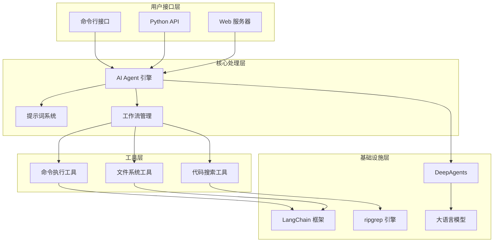

## 核心组件架构

### 1. AI Agent 引擎

#### 设计理念
AI Agent 是 CodeViewX 的核心大脑，负责理解用户需求、制定分析策略、协调工具执行，并生成最终的文档输出。

#### 组件结构
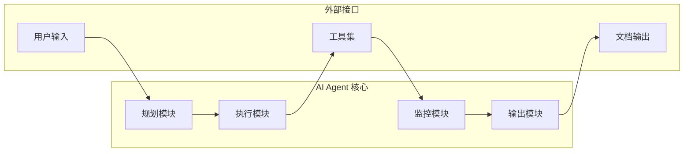

#### 关键特性
- **智能规划**: 基于项目特征自动制定分析策略
- **流式处理**: 支持实时进度反馈和中间结果展示
- **错误恢复**: 具备一定的错误处理和重试机制
- **上下文管理**: 维护长对话的上下文连贯性

### 2. 提示词系统

#### 架构设计
提示词系统采用模板化设计，支持动态参数注入和多语言适配。

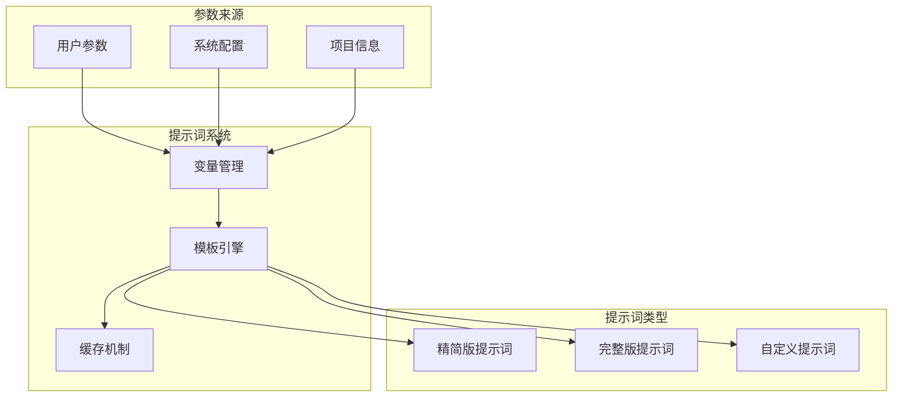

#### 提示词优化历程
1. **原始版本** (33KB): 功能完整但体积过大
2. **完整版本** (25KB): 结构化重组
3. **精简版本** (10KB): 核心功能保留，API 兼容性优化

#### 模板变量系统
```python
# 支持的变量类型
template_vars = {
    "working_directory": str,    # 工作目录路径
    "output_directory": str,     # 输出目录路径
    "doc_language": str,         # 文档语言
    "project_type": str,         # 项目类型（可选）
    "analysis_depth": str,       # 分析深度（可选）
}
```

### 3. 工具系统

#### 工具架构
工具系统采用插件化设计，每个工具都是独立的模块，通过标准化接口与 AI Agent 交互。

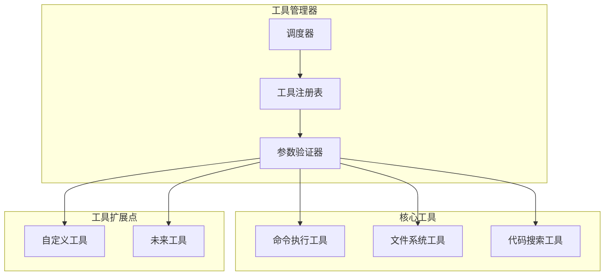

#### 工具接口规范
```python
class ToolInterface:
    """工具接口标准"""
    
    def execute(self, **kwargs) -> str:
        """执行工具并返回结果"""
        pass
    
    def validate_params(self, **kwargs) -> bool:
        """验证参数有效性"""
        pass
    
    def get_schema(self) -> dict:
        """获取工具参数模式"""
        pass
```

## 数据流架构

### 1. 文档生成流程

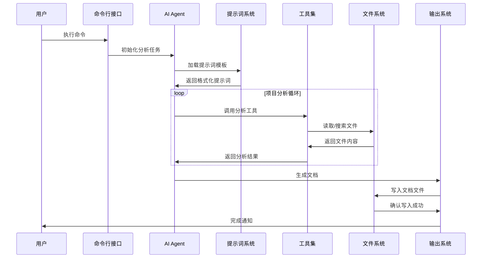

### 2. 数据处理管道

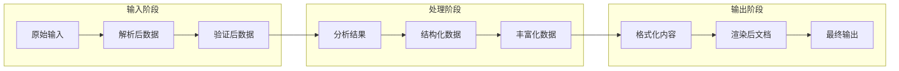

## 模块间通信架构

### 1. 事件驱动架构

CodeViewX 采用事件驱动的模块间通信机制，确保各组件的松耦合和高内聚。

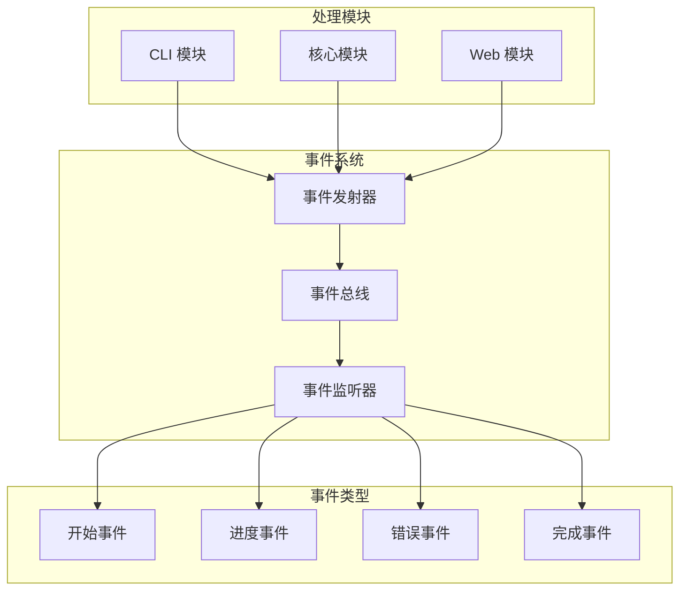

### 2. 配置管理架构

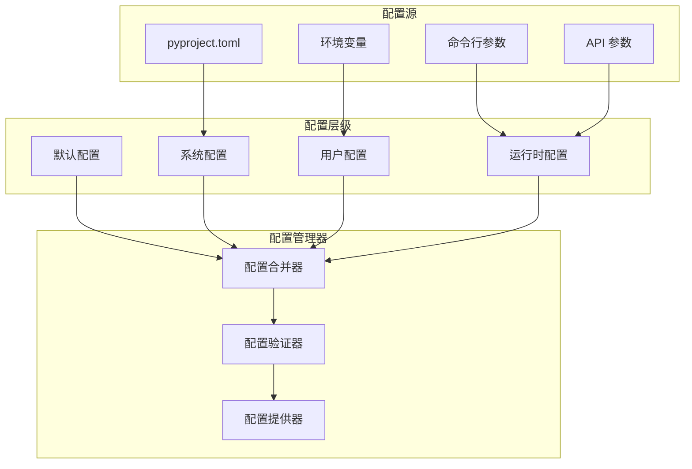

## 安全架构

### 1. 输入验证

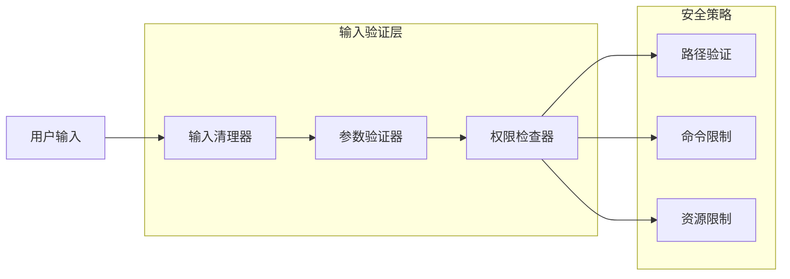

### 2. 执行安全

- **命令执行限制**: 30秒超时保护
- **文件系统隔离**: 相对路径限制
- **资源使用控制**: 内存和 CPU 限制
- **敏感信息过滤**: API 密钥保护

## 扩展架构

### 1. 插件系统设计

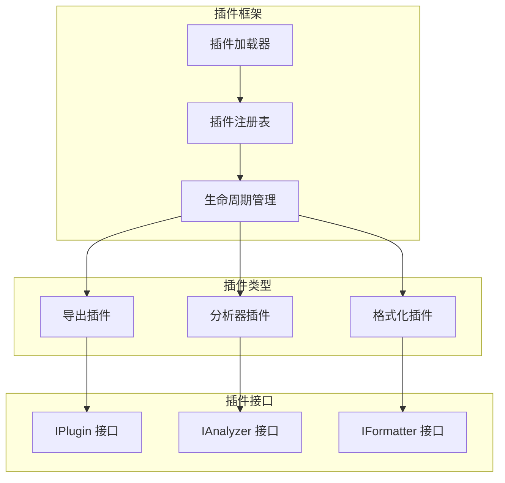

### 2. 多语言支持架构

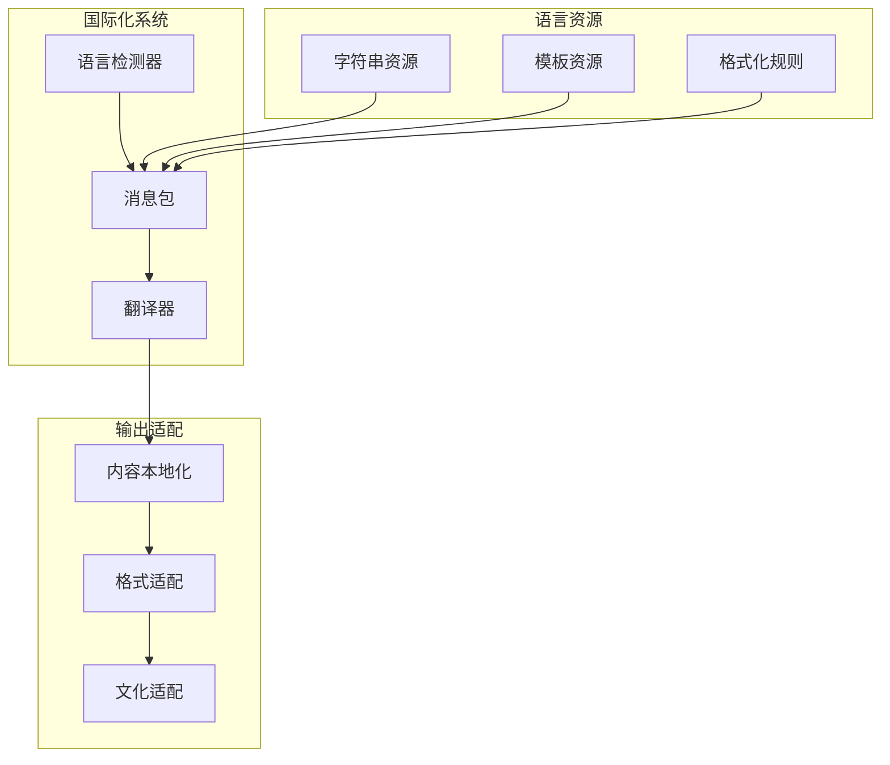

## 性能架构

### 1. 缓存策略

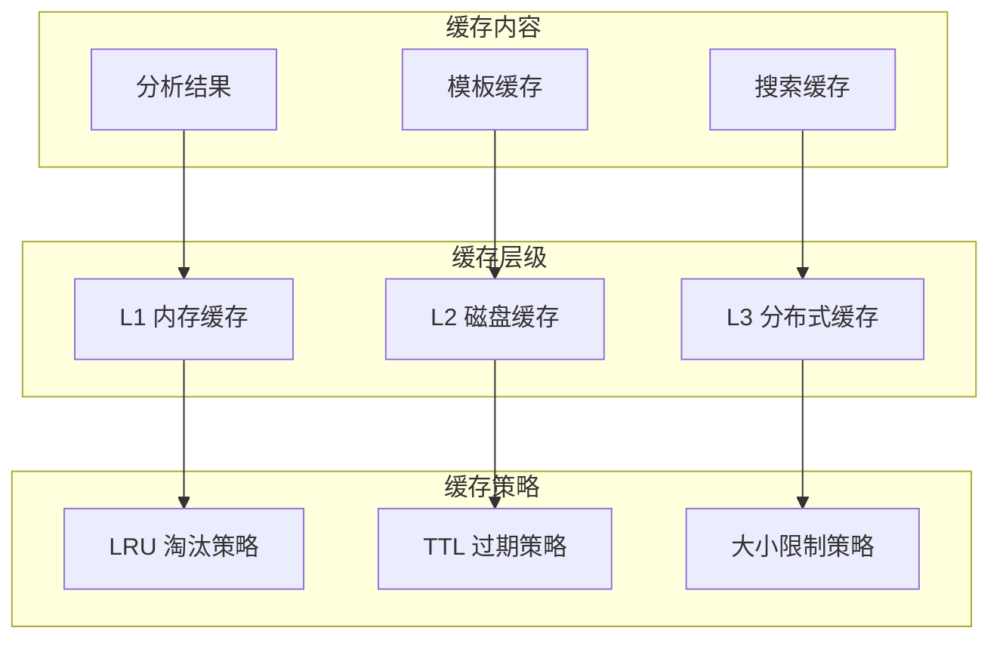

### 2. 并发处理架构

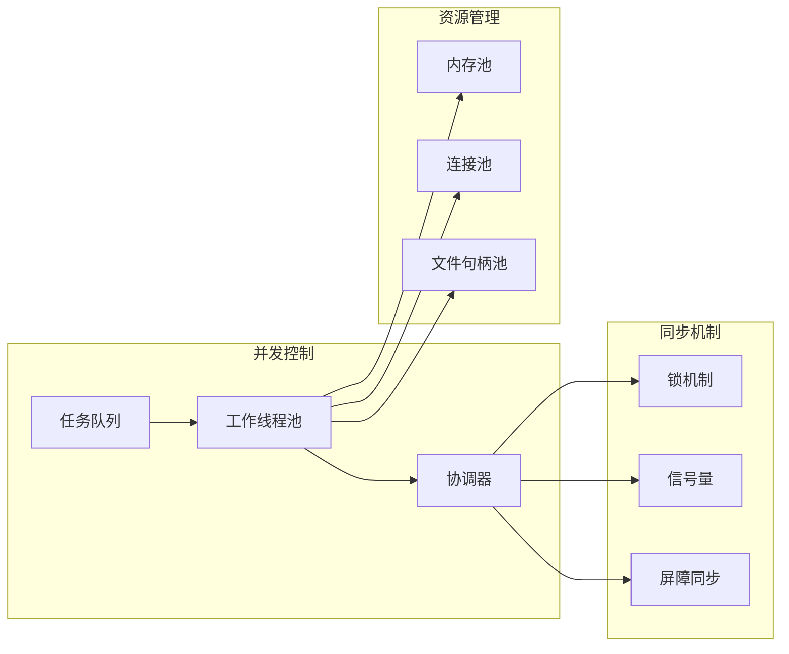

## 监控和诊断架构

### 1. 日志系统

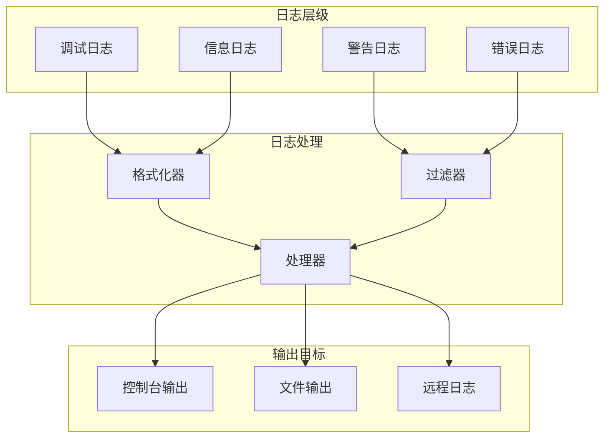

### 2. 性能监控

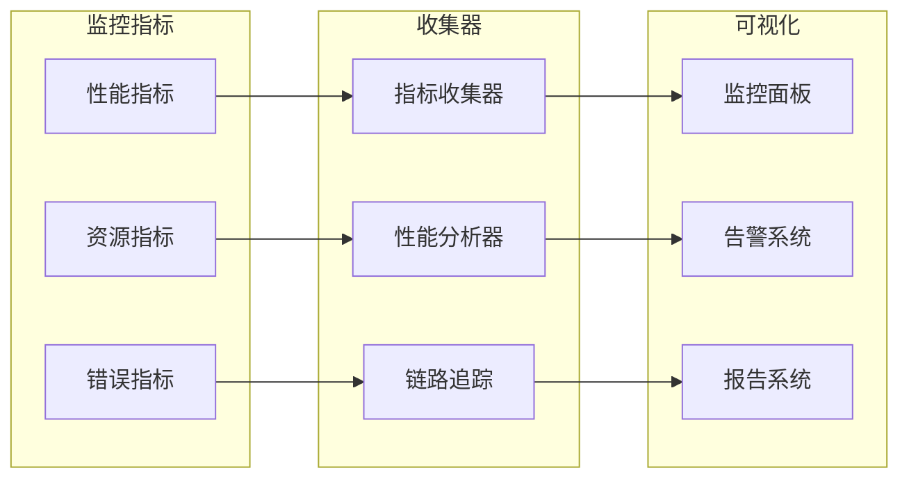

## 部署架构

### 1. 单机部署

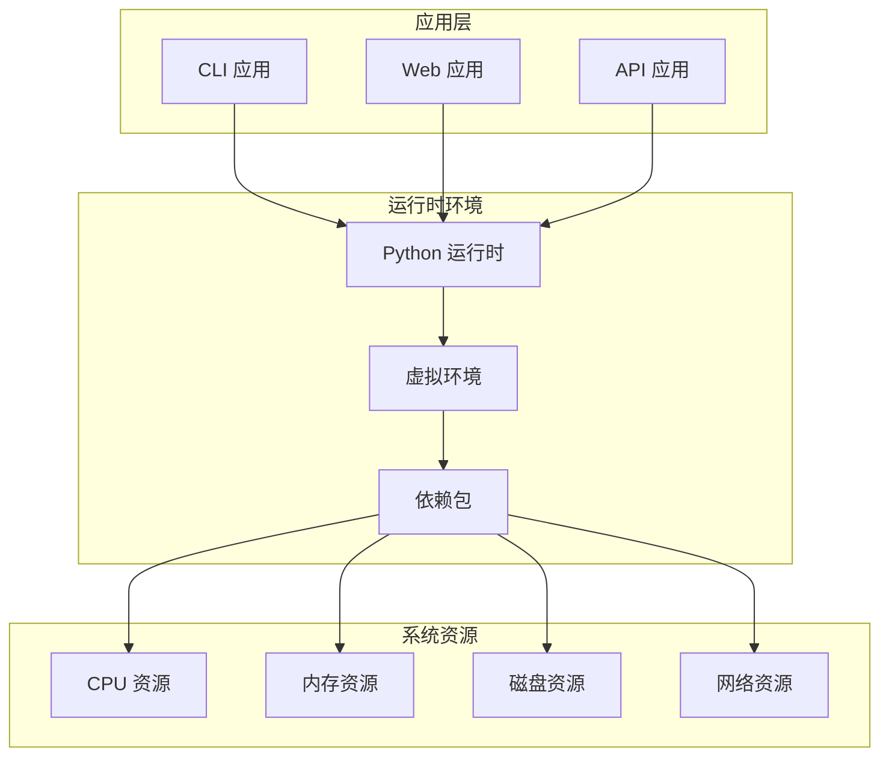

### 2. 容器化部署

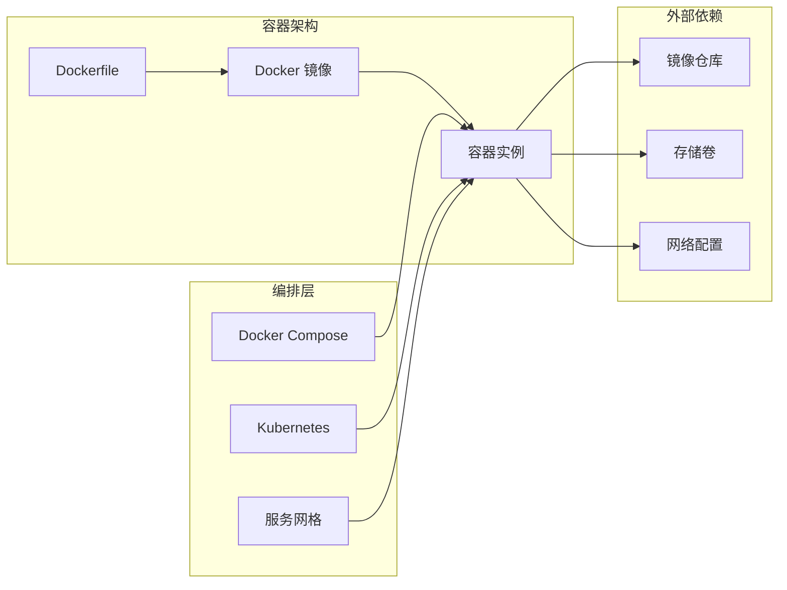

## 技术债务和改进方向

### 当前架构限制

1. **单 Agent 设计**: 当前版本使用单个 AI Agent，处理复杂项目时可能存在性能瓶颈
2. **内存占用**: 大型项目分析时内存使用较高
3. **并发能力**: 缺乏真正的并发处理能力
4. **插件生态**: 插件系统尚未完全实现

### 未来架构演进

1. **多 Agent 协作**: 引入专门的搜索、分析、生成 Agent
2. **分布式处理**: 支持多节点分布式分析
3. **流式处理**: 改进流式处理能力，减少内存占用
4. **智能缓存**: 基于内容哈希的智能缓存机制
5. **云原生**: 完全云原生的部署和扩展能力

---

这个架构设计为 CodeViewX 提供了坚实的技术基础，支持未来的功能扩展和性能优化。通过模块化设计和清晰的接口定义，系统具备良好的可维护性和可扩展性。