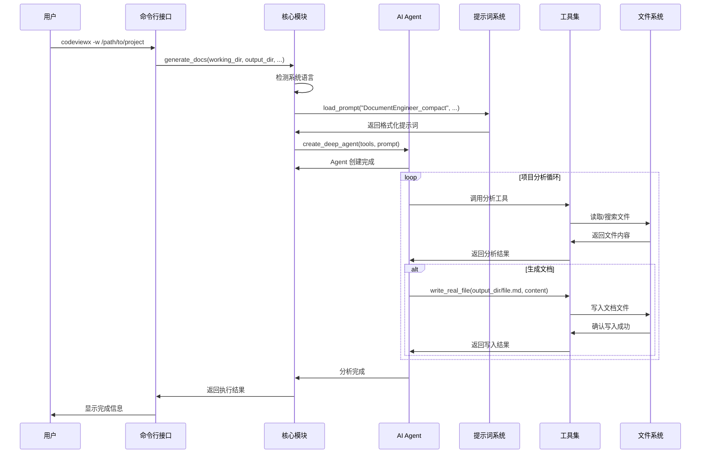
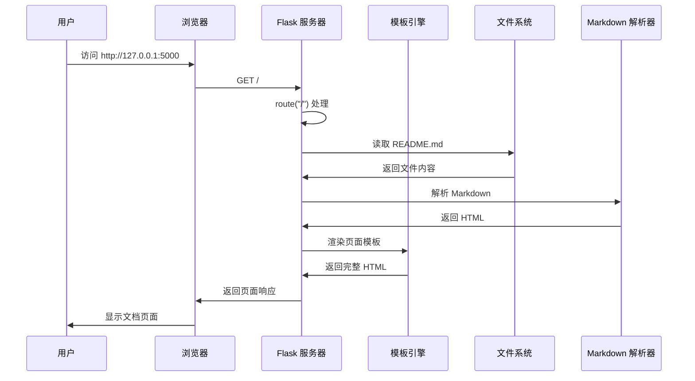
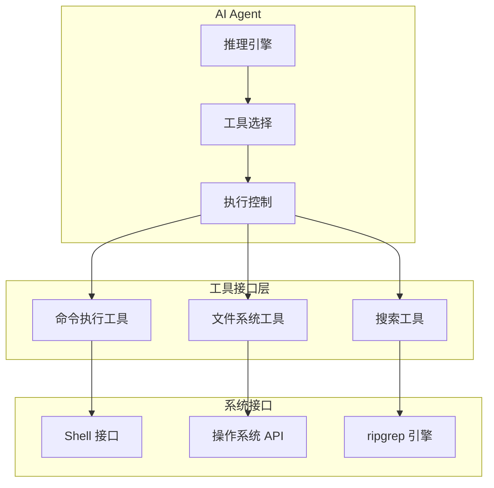
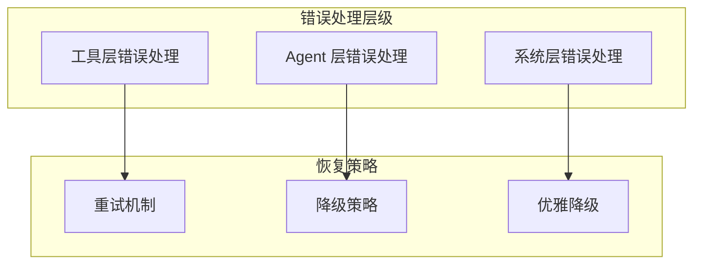

# 核心工作机制

## 概述

CodeViewX 的核心机制围绕 AI Agent 的智能分析能力展开，通过精心设计的工作流程实现从代码到文档的自动转换。本章深入剖析系统的工作原理、关键算法和实现细节。

## 核心流程 #1: 文档生成主流程

### 概述
文档生成主流程是 CodeViewX 的核心工作机制，负责将用户的代码库分析请求转换为完整的技术文档。该流程从命令行输入开始，经过项目分析、内容生成、文档渲染等多个阶段，最终输出结构化的技术文档。

**输入**: 项目路径 + 配置参数  
**处理**: AI 分析 + 工具协调 + 内容生成  
**输出**: Markdown 文档集合  

### 时序图



### 详细步骤

#### 步骤 1: 命令行解析和初始化

**触发条件**: 用户执行 `codeviewx` 命令

**核心代码**:
```python
# 文件：codeviewx/cli.py | 行：15-45 | 描述：命令行参数解析
def main():
    """命令行入口函数"""
    parser = argparse.ArgumentParser(
        prog="codeviewx",
        description="CodeViewX - AI 驱动的代码文档生成器",
        formatter_class=argparse.RawDescriptionHelpFormatter,
    )
    
    # 添加参数定义
    parser.add_argument("-w", "--working-dir", dest="working_directory", ...)
    parser.add_argument("-o", "--output-dir", dest="output_directory", ...)
    parser.add_argument("-l", "--language", dest="doc_language", ...)
    parser.add_argument("--verbose", action="store_true", ...)
    parser.add_argument("--serve", action="store_true", ...)
    
    args = parser.parse_args()
    
    # 根据参数执行不同模式
    if args.serve:
        start_document_web_server(args.output_directory)
    else:
        generate_docs(...)
```

**数据流**: 命令行参数 → argparse 解析 → 结构化参数对象 → 核心函数调用

**关键点**:
- 使用 argparse 提供标准的命令行接口
- 支持两种主要模式：文档生成和 Web 服务器
- 参数验证和默认值处理

#### 步骤 2: 系统环境检测

**触发条件**: 核心函数 `generate_docs()` 开始执行

**核心代码**:
```python
# 文件：codeviewx/core.py | 行：475-495 | 描述：系统语言检测
def detect_system_language() -> str:
    """检测系统语言"""
    try:
        # 尝试获取系统语言设置
        lang, encoding = locale.getdefaultlocale()
        
        if lang:
            # 规范化语言代码
            if lang.startswith('zh'):
                return 'Chinese'  # 中文
            elif lang.startswith('ja'):
                return 'Japanese'  # 日语
            # ... 其他语言映射
            else:
                return 'English'  # 默认英文
        
        return 'English'
    except Exception:
        return 'English'
```

**数据流**: 系统区域设置 → 语言代码映射 → 标准语言标识

**关键点**:
- 自动检测用户系统语言，提供本地化体验
- 异常处理确保系统稳定性
- 支持主流语言的自动识别

#### 步骤 3: 提示词加载和模板处理

**触发条件**: 系统环境检测完成后

**核心代码**:
```python
# 文件：codeviewx/core.py | 行：497-540 | 描述：提示词加载和模板处理
def load_prompt(name: str, **kwargs) -> str:
    """加载 AI 文档生成的系统提示词"""
    # 使用包资源读取提示词文件
    try:
        from importlib.resources import files
        prompt_file = files("codeviewx.prompts").joinpath(f"{name}.md")
        with prompt_file.open("r", encoding="utf-8") as f:
            template_text = f.read()
    except (ImportError, AttributeError):
        # 向后兼容处理
        package_dir = Path(__file__).parent
        prompt_path = package_dir / "prompts" / f"{name}.md"
        with open(prompt_path, "r", encoding="utf-8") as f:
            template_text = f.read()
    
    # 如果提供了变量，使用 PromptTemplate 进行格式化
    if kwargs:
        template = PromptTemplate.from_template(template_text)
        return template.format(**kwargs)
    
    return template_text
```

**数据流**: 提示词模板文件 → 模板文本 → 变量注入 → 格式化提示词

**关键点**:
- 使用 LangChain 的 PromptTemplate 支持变量插值
- 兼容不同 Python 版本的资源读取方式
- 动态注入工作目录、输出目录等运行时参数

#### 步骤 4: AI Agent 创建和工具注册

**触发条件**: 提示词加载完成

**核心代码**:
```python
# 文件：codeviewx/core.py | 行：570-585 | 描述：AI Agent 创建
def generate_docs(...):
    # 创建工具列表
    tools = [
        execute_command,
        ripgrep_search,
        write_real_file,
        read_real_file,
        list_real_directory,
    ]
    
    # 创建 Agent
    agent = create_deep_agent(tools, prompt)
```

**数据流**: 工具函数列表 → DeepAgents 框架 → AI Agent 实例

**关键点**:
- 工具函数通过 DeepAgents 框架注册给 AI Agent
- 每个工具都提供了与系统交互的特定能力
- Agent 具备调用这些工具来完成任务的能力

#### 步骤 5: 项目分析执行循环

**触发条件**: AI Agent 开始执行分析任务

**核心代码**:
```python
# 文件：codeviewx/core.py | 行：590-650 | 描述：项目分析主循环
for chunk in agent.stream(
    {"messages": [{"role": "user", "content": "请根据系统提示词中的工作目录，分析该项目并生成深度技术文档"}]},
    stream_mode="values",
    config={"recursion_limit": recursion_limit}
):
    if "messages" in chunk:
        step_count += 1
        last_message = chunk["messages"][-1]
        
        # 处理工具调用和结果
        if hasattr(last_message, 'tool_calls') and last_message.tool_calls:
            # 工具调用处理逻辑
            for tool_call in last_message.tool_calls:
                tool_name = tool_call.get('name', 'unknown')
                # 处理不同的工具调用...
```

**数据流**: 用户指令 → Agent 推理 → 工具调用 → 结果返回 → 下一步推理

**关键点**:
- 使用流式处理提供实时进度反馈
- 支持递归限制控制，防止无限循环
- 智能进度跟踪，区分分析阶段和文档生成阶段

### 异常处理

- **工具执行异常**: 每个工具函数都包含异常处理，确保单个工具失败不影响整体流程
- **超时处理**: 命令执行工具设置 30 秒超时保护
- **文件系统异常**: 文件读写操作包含完整的错误处理和用户友好的错误信息
- **网络异常**: AI API 调用失败时的重试和降级策略

### 设计亮点

1. **流式处理**: 通过流式 API 提供实时进度反馈，改善用户体验
2. **智能进度跟踪**: 区分分析阶段和文档生成阶段，提供有意义的进度信息
3. **模块化工具系统**: 每个工具职责单一，易于测试和维护
4. **多语言支持**: 自动语言检测和本地化文档生成
5. **灵活的配置**: 支持多种使用场景和自定义配置

## 核心流程 #2: Web 服务器机制

### 概述
Web 服务器机制为生成的文档提供美观的浏览界面，支持 Markdown 渲染、文件树导航和实时预览功能。

### 时序图



### 详细步骤

#### 步骤 1: Flask 应用初始化

**核心代码**:
```python
# 文件：codeviewx/core.py | 行：33-40 | 描述：Flask 应用初始化
def start_document_web_server(output_directory):
    current_dir = os.path.dirname(os.path.abspath(__file__))
    template_dir = os.path.join(current_dir, 'tpl')
    static_dir = os.path.join(current_dir, 'static')
    
    app = Flask(__name__, template_folder=template_dir, static_folder=static_dir)
```

**关键点**:
- 动态设置模板和静态文件目录
- 使用内置 Flask 服务器，简化部署

#### 步骤 2: 路由处理和文件读取

**核心代码**:
```python
# 文件：codeviewx/core.py | 行：42-85 | 描述：路由处理和 Markdown 渲染
@app.route("/<path:filename>")
def index(filename):
    if not filename or filename == "":
        filename = "README.md"
    
    index_file_path = os.path.join(output_directory, filename)
    if os.path.exists(index_file_path):
        with open(index_file_path, "r", encoding="utf-8") as f:
            content = f.read()
        
        # 自动插入 TOC 标记
        if '[TOC]' not in content:
            lines = content.split('\n')
            insert_index = 0
            for i, line in enumerate(lines):
                if line.strip().startswith('#'):
                    insert_index = i
                    break
            lines.insert(insert_index, '[TOC]')
            lines.insert(insert_index + 1, '')
            content = '\n'.join(lines)
```

**关键点**:
- 自动插入 TOC 标记，支持目录生成
- UTF-8 编码确保中文文档正确显示
- 默认文件处理逻辑

#### 步骤 3: Markdown 渲染和 HTML 生成

**核心代码**:
```python
# 文件：codeviewx/core.py | 行：87-105 | 描述：Markdown 渲染配置
import markdown
from markdown.extensions.toc import TocExtension

toc_extension = TocExtension(
    permalink=True,
    permalink_class='headerlink',
    title='目录',
    baselevel=1,
    toc_depth=6,
    marker='[TOC]'
)

html = markdown.markdown(
    content,
    extensions=[
        'tables',
        'fenced_code',
        'codehilite',
        toc_extension
    ],
    extension_configs={
        'codehilite': {
            'css_class': 'language-',
            'use_pygments': False  # 使用 Prism.js
        }
    }
)
```

**关键点**:
- 支持表格、代码块、目录等扩展功能
- 配置 Prism.js 进行代码高亮
- 生成锚点链接，便于导航

#### 步骤 4: 文件树生成

**核心代码**:
```python
# 文件：codeviewx/core.py | 行：107-155 | 描述：文件树数据生成
def generate_file_tree(directory, current_file=None):
    """生成目录的文件树数据结构"""
    if not os.path.exists(directory):
        return []

    file_tree = []
    try:
        items = []
        for item in os.listdir(directory):
            item_path = os.path.join(directory, item)
            if os.path.isfile(item_path):
                items.append(item)
        
        items.sort()  # 按文件名排序
        
        for item in items:
            file_path = os.path.join(directory, item)
            rel_path = os.path.relpath(file_path, directory)
            
            # 确定文件类型和显示名称
            file_type = 'markdown'
            display_name = item
            
            if item.lower().endswith('.md'):
                if item.upper() == 'README.MD':
                    display_name = 'README'
                else:
                    # 尝试读取标题
                    title = get_markdown_title(file_path)
                    if title:
                        display_name = title
                    else:
                        display_name = item[:-3] if item.endswith('.md') else item
            
            # 检查是否是当前文件
            is_active = (item == current_file)
            
            file_tree.append({
                'name': item,
                'display_name': display_name,
                'path': rel_path,
                'type': file_type,
                'active': is_active
            })
    except Exception as e:
        print(f"Error generating file tree: {e}")
    
    return file_tree
```

**关键点**:
- 智能提取 Markdown 文件标题作为显示名称
- 文件排序和高亮当前文件
- 异常处理确保服务器稳定性

## 核心流程 #3: 工具系统机制

### 概述
工具系统为 AI Agent 提供与外部世界交互的能力，每个工具都是专门设计的函数，负责特定的任务类型。

### 工具架构



### 工具 #1: 命令执行工具

**核心代码**:
```python
# 文件：codeviewx/tools/command.py | 行：12-40 | 描述：系统命令执行
def execute_command(command: str, working_dir: str = None) -> str:
    """执行系统命令并返回结果"""
    try:
        result = subprocess.run(
            command,
            shell=True,
            capture_output=True,
            text=True,
            cwd=working_dir,
            timeout=30  # 30秒超时
        )
        
        # 组合标准输出和错误输出
        output = ""
        if result.stdout:
            output += result.stdout
        if result.stderr:
            output += f"\n[错误输出]\n{result.stderr}"
        
        return output if output else "命令执行成功，无输出"
    
    except subprocess.TimeoutExpired:
        return "❌ 错误: 命令执行超时（30秒）"
    except Exception as e:
        return f"❌ 错误: {str(e)}"
```

**设计特点**:
- 安全的超时机制防止恶意命令执行
- 统一的输出格式，包含标准输出和错误输出
- 支持工作目录切换，适应不同项目结构

### 工具 #2: 文件系统工具

**核心代码**:
```python
# 文件：codeviewx/tools/filesystem.py | 行：12-35 | 描述：文件写入
def write_real_file(file_path: str, content: str) -> str:
    """写入真实文件系统中的文件"""
    try:
        # 确保目录存在
        directory = os.path.dirname(file_path)
        if directory and not os.path.exists(directory):
            os.makedirs(directory, exist_ok=True)
        
        # 写入文件
        with open(file_path, 'w', encoding='utf-8') as f:
            f.write(content)
        
        # 获取文件大小
        file_size = os.path.getsize(file_path)
        file_size_kb = file_size / 1024
        
        return f"✅ 成功写入文件: {file_path} ({file_size_kb:.2f} KB)"
    
    except Exception as e:
        return f"❌ 写入文件失败: {str(e)}"
```

**设计特点**:
- 自动创建目录结构，简化路径处理
- UTF-8 编码确保多语言支持
- 详细的返回信息，包含文件大小统计

### 工具 #3: 代码搜索工具

**核心代码**:
```python
# 文件：codeviewx/tools/search.py | 行：12-65 | 描述：高性能代码搜索
def ripgrep_search(pattern: str, path: str = ".", 
                   file_type: str = None, 
                   ignore_case: bool = False,
                   max_count: int = 100) -> str:
    """使用 ripgrep 在文件中搜索文本模式"""
    try:
        # 创建 Ripgrepy 实例
        rg = Ripgrepy(pattern, path)
        
        # 配置选项
        rg = rg.line_number()  # 显示行号
        rg = rg.with_filename()  # 显示文件名
        rg = rg.max_count(max_count)  # 限制结果数
        
        # 忽略大小写
        if ignore_case:
            rg = rg.ignore_case()
        
        # 文件类型过滤
        if file_type:
            rg = rg.type_add(file_type)
        
        # 自动忽略的目录和文件
        ignore_patterns = [
            ".git", ".venv", "venv", "env", "node_modules", 
            "__pycache__", ".pytest_cache", ".mypy_cache",
            "dist", "build", "target", ".cache", "*.pyc",
            ".DS_Store", "Thumbs.db", "*.log"
        ]
        for ignore_pattern in ignore_patterns:
            rg = rg.glob(f"!{ignore_pattern}")
        
        # 执行搜索
        result = rg.run().as_string
        
        return result if result.strip() else f"未找到匹配 '{pattern}' 的内容"
    
    except Exception as e:
        error_msg = str(e)
        if "rg" in error_msg.lower() and ("not found" in error_msg.lower()):
            return "错误: ripgrep (rg) 未安装。请先安装: brew install ripgrep"
        return f"搜索错误: {error_msg}"
```

**设计特点**:
- 基于 ripgrep 的高性能搜索，比传统 grep 快很多
- 智能忽略常见无关文件和目录
- 支持正则表达式、文件类型过滤等多种搜索模式
- 友好的错误提示，包含 ripgrep 安装指导

## 核心流程 #4: 进度跟踪和用户体验

### 概述
进度跟踪机制通过分析 AI Agent 的执行流，为用户提供有意义的进度信息，提升用户体验。

### 进度检测算法

**核心代码**:
```python
# 文件：codeviewx/core.py | 行：600-680 | 描述：智能进度跟踪
for chunk in agent.stream(...):
    # 检测工具调用，提供简洁的进度提示
    if hasattr(last_message, 'tool_calls') and last_message.tool_calls and not verbose:
        tool_names = []
        doc_file = None
        todos_info = None
        
        for tool_call in last_message.tool_calls:
            tool_name = tool_call.get('name', 'unknown')
            args = tool_call.get('args', {})
            tool_names.append(tool_name)
            
            # 检测 todos 创建/更新
            if tool_name == 'write_todos':
                todos = args.get('todos', [])
                if todos:
                    completed_count = sum(1 for t in todos if t.get('status') == 'completed')
                    total_count = len(todos)
                    
                    # 智能显示条件
                    should_show = False
                    if not todos_shown and total_count > 0:  # 第一次创建
                        should_show = True
                    elif completed_count >= last_todos_count + 2:  # 实质性进展
                        should_show = True
                    elif completed_count == total_count and total_count > 0:  # 全部完成
                        should_show = True
                    
                    if should_show:
                        todos_info = [f"{status_icon} {content}" for todo in todos]
            
            # 检测文档写入操作
            elif tool_name == 'write_real_file':
                file_path = args.get('file_path', '')
                if file_path and output_directory in file_path:
                    doc_file = file_path.split('/')[-1]
```

**设计特点**:
- 智能过滤：只在有实质性进展时显示进度
- 分层显示：优先显示任务规划，然后是文档生成
- 状态感知：根据工具调用类型判断当前阶段
- 用户体验：避免信息过载，提供有意义的进度反馈

### 简洁模式 vs 详细模式

```python
# 标准模式：显示简洁的消息内容
if not verbose:
    # 提取 AI 回复摘要
    if message_type == 'AIMessage' and hasattr(last_message, 'content'):
        content = str(last_message.content).strip()
        if content and len(content) > 20 and not has_tool_calls:
            summary = content[:200].replace('\n', ' ').strip()
            if len(content) > 200:
                summary += "..."
            print(f"\n💭 AI: {summary}")

# 详细模式：显示完整信息
if verbose:
    print(f"\n{'='*80}")
    print(f"📍 步骤 {step_count} - {last_message.__class__.__name__}")
    print(f"{'='*80}")
    last_message.pretty_print()
```

## 核心流程 #5: 多语言支持机制

### 概述
多语言支持机制确保生成的文档内容符合用户的语言偏好，从系统语言检测到内容本地化的完整流程。

### 语言检测算法

**核心代码**:
```python
# 文件：codeviewx/core.py | 行：475-495 | 描述：系统语言检测
def detect_system_language() -> str:
    """检测系统语言"""
    try:
        # 获取系统语言设置
        lang, encoding = locale.getdefaultlocale()
        
        if lang:
            # 语言代码映射
            language_mapping = {
                'zh': 'Chinese',
                'ja': 'Japanese', 
                'ko': 'Korean',
                'fr': 'French',
                'de': 'German',
                'es': 'Spanish',
                'ru': 'Russian'
            }
            
            # 查找匹配的语言
            for code, language in language_mapping.items():
                if lang.startswith(code):
                    return language
            
            return 'English'  # 默认英文
        
        return 'English'
    except Exception:
        return 'English'
```

**设计特点**:
- 基于系统区域设置的自动检测
- 支持主流语言的自动识别
- 异常安全，默认返回英文

### 提示词本地化

通过在提示词模板中注入语言参数，实现 AI 生成内容的本地化：

```python
# 在加载提示词时注入语言参数
prompt = load_prompt(
    "DocumentEngineer_compact",
    working_directory=working_directory,
    output_directory=output_directory,
    doc_language=doc_language  # 关键参数
)
```

## 性能优化机制

### 1. 流式处理优化

- **减少内存占用**: 通过流式处理避免一次性加载大量数据
- **实时反馈**: 用户可以立即看到分析进度
- **中断支持**: 支持用户中断长时间运行的任务

### 2. 工具调用优化

- **并行处理**: 工具可以并行执行，提高效率
- **结果缓存**: 相同查询的结果可以缓存复用
- **智能过滤**: 搜索工具自动过滤无关文件

### 3. 提示词优化

- **精简版本**: 从 33KB 优化到 10KB，避免 API 限制
- **模板化**: 支持变量注入，减少重复内容
- **分层设计**: 不同复杂度的提示词版本

## 错误处理和恢复机制

### 1. 分层错误处理



### 2. 具体错误处理示例

**文件读取错误**:
```python
try:
    with open(file_path, 'r', encoding='utf-8') as f:
        content = f.read()
except FileNotFoundError:
    return f"❌ 错误: 文件 '{file_path}' 不存在"
except PermissionError:
    return f"❌ 错误: 没有权限读取文件 '{file_path}'"
except UnicodeDecodeError:
    return f"❌ 错误: 文件 '{file_path}' 不是文本文件或编码不是 UTF-8"
```

**命令执行错误**:
```python
try:
    result = subprocess.run(command, shell=True, capture_output=True, ...)
except subprocess.TimeoutExpired:
    return "❌ 错误: 命令执行超时（30秒）"
except Exception as e:
    return f"❌ 错误: {str(e)}"
```

## 总结

CodeViewX 的核心机制体现了现代 AI 应用的设计原则：

1. **AI 驱动**: 通过 AI Agent 实现智能分析和内容生成
2. **工具化设计**: 模块化的工具系统提供可扩展的能力
3. **用户体验**: 流式处理、进度跟踪、多语言支持
4. **稳定性**: 完善的错误处理和恢复机制
5. **性能优化**: 多层次的性能优化策略

这些核心机制的协同工作，使得 CodeViewX 能够将复杂的代码库转换为高质量的技术文档，为开发者提供强大的文档生成能力。